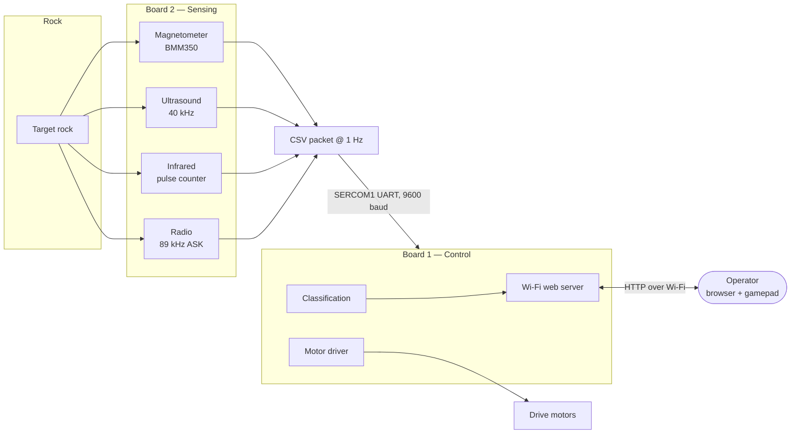

<div align="center">

# Lunar-ICE Rover

**A remotely operated lunar rover that drives a simulated lunar surface and identifies rocks
by their radio, infrared, ultrasonic and magnetic signatures.**

Imperial College London · ELEC40006 Electronics Design Project 1 (EEERover) · Group 15

[](docs/README.md)
[](#the-sensors)
[](#system-architecture)
[](#build-and-run)
[](docs/images/README.md)

<br>


</div>

## The sensors

Four independent subsystems. The **radio** reports the rock's age; the other three combine to give its type.

<table>
<tr>
<td width="50%" align="center" valign="top">
<a href="docs/03-radio.md"></a>
<br><b>Radio</b> · rock age
<br><sub>120-turn ferrite coil tuned to 89&nbsp;kHz.<br>ASK carrier, UART at 600&nbsp;baud.</sub>
</td>
<td width="50%" align="center" valign="top">
<a href="docs/02-infrared.md"></a>
<br><b>Infrared</b> · rock type
<br><sub>SFH300 phototransistor, ×100 amplifier,<br>band-pass filter, LM393 comparator.</sub>
</td>
</tr>
<tr>
<td width="50%" align="center" valign="top">
<a href="docs/04-ultrasound.md"></a>
<br><b>Ultrasound</b> · rock type
<br><sub>Prowave 400SR160 receiver, two ×34 stages,<br>deliberately clipped, envelope detected.</sub>
</td>
<td width="50%" align="center" valign="top">
<a href="docs/05-magnetic-field.md"></a>
<br><b>Magnetic</b> · rock type
<br><sub>SEN0619 (BMM350) TMR magnetometer,<br>0.1&nbsp;µT resolution over I²C.</sub>
</td>
</tr>
</table>

Click any sensor to read its full design write-up.

## What it does

The rover is driven by an operator through a browser-based mission control page over Wi-Fi. It manoeuvres around large obstacles, parks next to a target rock, sweeps a servo-driven sensor arm across it, and reports back what the rock is and how old it is.

Each rock type maps to a unique combination of the three type-sensors:

| Rock type | Infrared | Ultrasound | Magnetic |
|:---|:---|:---|:---|
| **Basaltoid** | 547 Hz | Present | Down |
| **Gravion** | 312 Hz | Absent | Down |
| **Regolix** | 312 Hz | Present | Up |
| **Lunarite** | 547 Hz | Absent | Up |

Read as a truth table, any **two** of the three columns identify all four types. All three are measured anyway, so they cross-check one another and produce a **confidence score** — the figure that tells the operator when a reading is unreliable and should be rescanned.

A scan runs for 5 seconds, sampling every 200 ms. The two binary sensors are settled by majority vote; the infrared decision comes from Board 2's own classification of the measured pulse rate. Full detail in [chapter 10](docs/10-dual-board-architecture.md#107-rock-classification).

## System architecture

The rover runs on **two Adafruit Metro M0 Express boards** (SAMD21, 48 MHz Cortex-M0+), split by responsibility.



Board 2 sends a single newline-terminated CSV line once per second:

```
AGE:3.82,IR:539,IRC:547,IRCO:93,US:1,MAG:DOWN
```

Splitting the system this way keeps sensor timing completely independent of Wi-Fi activity. Serving a page over the WINC1500 blocks the processor in bursts, which would otherwise disturb the 50 µs infrared pulse measurements. The reasoning, the packet format and the SERCOM link are covered in [chapter 10](docs/10-dual-board-architecture.md).

<div align="center">

</div>

## Documentation

The complete write-up — design reasoning, calculations, LTspice simulations, oscilloscope captures, CAD renders and PCB layouts — lives in [`docs/`](docs/README.md).

| # | Chapter | What it covers |
|:--|:---|:---|
| 01 | [System overview](docs/01-system-overview.md) | Mission objectives, rock types, architecture, data flow |
| 02 | [Infrared sensing](docs/02-infrared.md) | Phototransistor front-end, band-pass filtering, comparator, pulse counting |
| 03 | [Radio sensing](docs/03-radio.md) | Ferrite antenna, tuned LC, amplifier, envelope detector, Schmitt trigger, UART decode |
| 04 | [Ultrasound sensing](docs/04-ultrasound.md) | 40 kHz transducer, two-stage gain, deliberate clipping, envelope detection |
| 05 | [Magnetic field sensing](docs/05-magnetic-field.md) | Hall-effect dead end, switch to a TMR magnetometer, thresholds |
| 06 | [Mechanical design](docs/06-mechanical-design.md) | Two-plate chassis, radio arm, servo-driven sensor sweep arm |
| 07 | [Movement and control](docs/07-movement-and-control.md) | Tank steering, keyboard control, gamepad mixing, latency fix |
| 08 | [PCB design](docs/08-pcb-design.md) | Two-board split, schematics, footprints, layout rules |
| 09 | [Web interface](docs/09-web-interface.md) | Mission control page, chunked serving, scan workflow |
| 10 | [Dual-board architecture](docs/10-dual-board-architecture.md) | Why two boards, SERCOM UART link, packet format, classification |
| 11 | [Cost and bill of materials](docs/11-cost-and-bom.md) | Component spend against budget |
| 12 | [References](docs/12-references.md) | Datasheets and sources |

New to the project? Start with [chapter 01](docs/01-system-overview.md).

## Repository layout

```
Lunar-ICE/
├── docs/                      Technical documentation and all 71 figures
│
├── Full_Board_Code/           Flight firmware — the code that runs on the rover
│   ├── Board 1/               Wi-Fi, web server, motors, rock classification
│   └── Board 2/               All four sensors, streams CSV packets to Board 1
│
├── Lonely_Board/              Single-board prototype (everything on one Metro M0)
│
├── sensing/                   Per-subsystem research, test firmware and PCBs
│   ├── Infrared/              IR pulse-detection test code
│   ├── radio/                 Coil calculations and radio test code
│   ├── ultrasonic/            Ultrasonic test code and design notes
│   ├── magnetic/              Magnetometer test code
│   └── PCBs/                  KiCad projects and manufacturing Gerbers
│
└── software/                  Web interface, servo tests, classification notes
    ├── Website/rover_website/ Board 1 firmware serving mission control
    └── Servo_test/            Sensor-arm servo sweep test
```

Every folder has its own README: [docs](docs/README.md) · [figures](docs/images/README.md) · [firmware](Full_Board_Code/README.md) · [prototype](Lonely_Board/README.md) · [sensing](sensing/README.md) · [software](software/README.md)

Every folder under `sensing/` and `software/` containing a `platformio.ini` is a standalone [PlatformIO](https://platformio.org/) project and builds on its own.

## Build and run

You will need [PlatformIO](https://platformio.org/install) and two Adafruit Metro M0 Express boards, one fitted with a WINC1500 Wi-Fi shield.

**1. Wire the two boards together.** Two conductors — the link is one-way, because Board 2 only ever sends.

```
Board 2 pin 10 (TX)  ──────▶  Board 1 pin 11 (RX)
Board 2 GND          ───────  Board 1 GND
```

**2. Set your network credentials** near the top of `Full_Board_Code/Board 1/src/main.cpp`.

**3. Flash both boards.**

```bash
cd "Full_Board_Code/Board 1"     # Wi-Fi, web interface, motors, classification
pio run --target upload

cd "Full_Board_Code/Board 2"     # sensors
pio run --target upload
```

**4. Find the rover.** On boot Board 1 prints its IP address over USB serial — run `pio device monitor` to read it, then open that address in a browser on the same network.

> Both projects set `lib_ignore = Adafruit TinyUSB Library`. Without it the build fails on a USB symbol conflict with the WiFi101 stack. Don't remove it.

**5. Drive and scan.** Use a connected gamepad for analogue steering or the WASD keys; the mode selector switches between them and changes automatically when a controller is plugged in. Stop next to a rock, press **SCAN ROCK**, and after 5 seconds the panel reports type, age and confidence. A low confidence figure means the sensors disagreed — reposition and scan again.

<div align="center">

</div>

## Results

| Measurement | Result |
|:---|:---|
| Infrared pulse rate accuracy | Within ~10% of the true 312 Hz / 547 Hz rates across repeated tests |
| Radio decode | Clean 0–3.44 V digital output; age recovered reliably over UART at 600 baud |
| Ultrasound margin | ~2.6 V present / ~0 V absent — about 1 V either side of the 1.8 V logic threshold |
| Magnetic detection range | ~7 cm, against ~5 mm for the Hall-effect sensor first tried |
| Board 1 resource use | ~38% of 256 KB flash, ~18% of 32 KB RAM |
| Inter-board link utilisation | ~5% of the available 9600 baud |
| Total component spend | £31.76 of a £60 budget |

Each figure is derived and evidenced in the corresponding [documentation chapter](docs/README.md).

## Team

**Group 15**

| Name | CID | Main contributions |
|:---|:---|:---|
| Tibor Varga | 02661206 | Radio circuit design and LTspice simulation |
| Junhao Liu | 02650256 | Chassis and sensor arm CAD, magnetic sensing |
| Qais Masri | 02689451 | Radio research, PCB design, movement and controller, finances |
| Tunir Sarkar | 02648912 | Infrared sensor and firmware |
| Yangping Li | 02651828 | Motor subsystem and drive integration |
| Shivang Mehra | 02723852 | Ultrasound and magnetic sensing, integration |

**Use of AI assistance.** Parts of the web interface and firmware were written with the assistance of an AI tool (Anthropic's Claude). The team specified the required behaviour, then reviewed, tested and debugged all code on the hardware. The design decisions and the understanding behind them are the team's own. This is stated in the project report and repeated here for transparency.

<div align="center">
<br>

[](docs/README.md)

</div>
