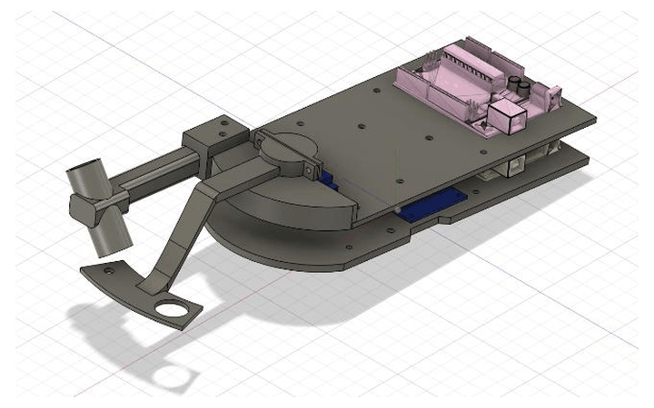
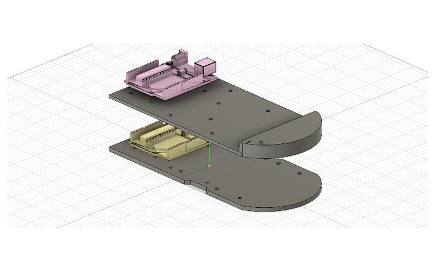
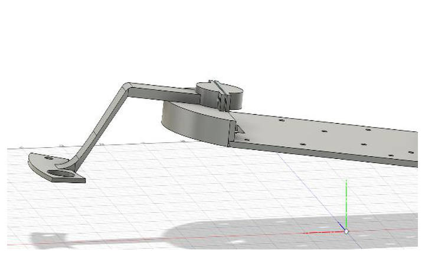
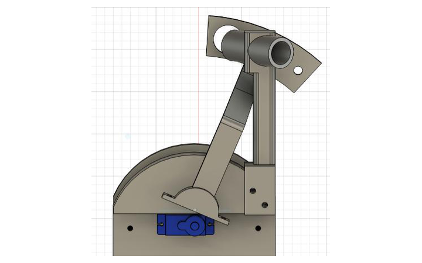
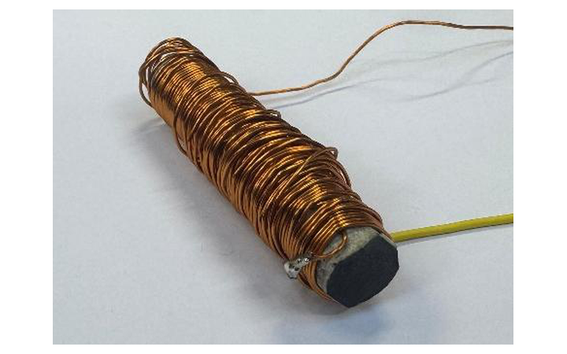
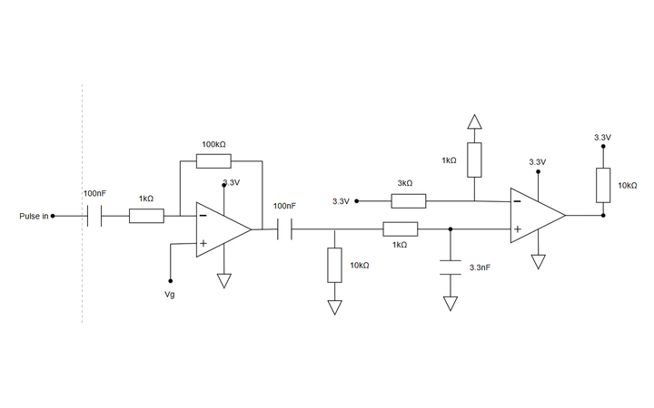
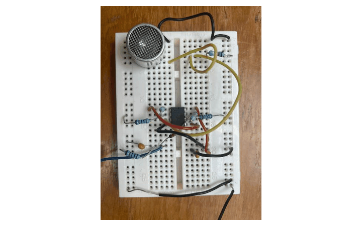
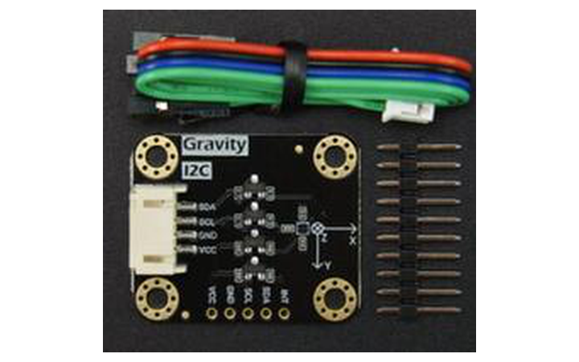
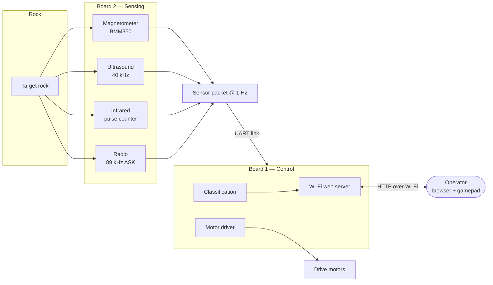
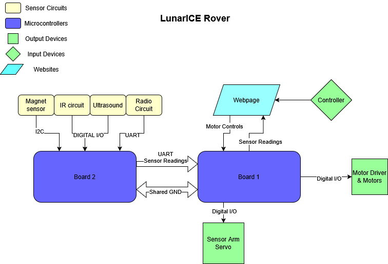

<div align="center">

# Lunar-ICE Rover

**A remotely operated lunar rover that drives a simulated lunar surface and identifies rocks
by their radio, infrared, ultrasonic and magnetic signatures.**

Imperial College London · ELEC40006 Electronics Design Project 1 (EEERover) · Group 15

[](docs/README.md)
[](#contents)
[](#the-sensors)
[](#system-architecture)
[](#team)

</div>

## About the project

The goal was to design and build, from scratch, a remotely controlled rover capable of exploring a simulated lunar surface and surveying the rocks it finds there. The rover has to be driven around large obstacles by a remote operator, park itself next to a target rock, and work out two things about it: **how old it is**, and **what type of rock it is**.

Nothing about the rock is visible from the outside. Everything the rover reports has to be recovered from four faint signals the rock emits — a radio transmission carrying its age, infrared pulses, an ultrasonic tone, and a magnetic field. Each of those needed its own sensor, its own analogue signal chain to pull a usable signal out of the noise, and its own place on the chassis.

The project ran over one term as a six-person group design exercise, and had to satisfy a handful of hard constraints:

- **Under 750 g** all-up mass
- **£60 budget** for components
- **3.3 V logic throughout** — the microcontroller's inputs are not 5 V tolerant
- Driven entirely by a **remote operator**, with no line-of-sight assumptions beyond the same Wi-Fi network

<div align="center">
<table>
<tr>
<td width="50%" align="center" valign="top">

<br><sub><b>Complete assembly</b> — both plates, radio arm and sensor arm</sub>
</td>
<td width="50%" align="center" valign="top">

<br><sub><b>Two-plate stack</b> — motors and power below, sensors above</sub>
</td>
</tr>
<tr>
<td width="50%" align="center" valign="top">

<br><sub><b>Sensor arm</b> — sweeps three sensors across the rock</sub>
</td>
<td width="50%" align="center" valign="top">

<br><sub><b>Radio arm</b> — fixed, angled down toward the rock</sub>
</td>
</tr>
</table>
</div>

> These are the Fusion 360 renders. Photographs of the built rover are the one thing this repository still lacks — see [the wanted list](docs/images/README.md#photographs-still-wanted).

<div align="right"><a href="#lunar-ice-rover"></a></div>

## Contents

| Section | What you will find |
|:---|:---|
| **[About the project](#about-the-project)** | Goals, constraints and what the rover has to do |
| **[Team](#team)** | Who built it, and who did what |
| **[The sensors](#the-sensors)** | The four sensing subsystems, one picture each |
| **[Identifying a rock](#identifying-a-rock)** | How four signals become a rock type and an age |
| **[System architecture](#system-architecture)** | The two-board split and how data flows |
| **[Documentation](#documentation)** | All twelve technical chapters |
| **[Repository layout](#repository-layout)** | Where everything lives |
| **[Build and run](#build-and-run)** | Getting it onto the hardware |

For the full technical write-up — calculations, simulations, measurements and PCB files — go to **[the documentation](docs/README.md)**.

<div align="right"><a href="#lunar-ice-rover"></a></div>

## Team

**Group 15** — six first-year students, with the work split by subsystem.

| Name | Main contributions |
|:---|:---|
| **Tibor Varga** | Radio circuit design and LTspice simulation |
| **Junhao Liu** | Chassis and sensor arm CAD, magnetic sensing |
| **Qais Masri** | Radio research, PCB design, movement and controller, finances |
| **Tunir Sarkar** | Infrared sensor and firmware |
| **Yangping Li** | Motor subsystem and drive integration |
| **Shivang Mehra** | Ultrasound and magnetic sensing, integration |

**Use of AI assistance.** Parts of the web interface and firmware were written with the assistance of an AI tool (Anthropic's Claude). The team specified the required behaviour, then reviewed, tested and debugged all code on the hardware. The design decisions and the understanding behind them are the team's own.

<div align="right"><a href="#lunar-ice-rover"></a></div>

## The sensors

Four independent subsystems. The **radio** reports the rock's age; the other three combine to give its type.

<table>
<tr>
<td width="50%" align="center" valign="top">
<a href="docs/03-radio.md"></a>
<br><b>Radio</b> · rock age
<br><sub>120-turn ferrite coil tuned to 89&nbsp;kHz.<br>ASK carrier, UART at 600&nbsp;baud.</sub>
</td>
<td width="50%" align="center" valign="top">
<a href="docs/02-infrared.md"></a>
<br><b>Infrared</b> · rock type
<br><sub>SFH300 phototransistor, ×100 amplifier,<br>band-pass filter, LM393 comparator.</sub>
</td>
</tr>
<tr>
<td width="50%" align="center" valign="top">
<a href="docs/04-ultrasound.md"></a>
<br><b>Ultrasound</b> · rock type
<br><sub>Prowave 400SR160 receiver, two ×34 stages,<br>deliberately clipped, envelope detected.</sub>
</td>
<td width="50%" align="center" valign="top">
<a href="docs/05-magnetic-field.md"></a>
<br><b>Magnetic</b> · rock type
<br><sub>SEN0619 (BMM350) TMR magnetometer,<br>0.1&nbsp;µT resolution over I²C.</sub>
</td>
</tr>
</table>

Click any sensor to read its full design write-up.

<div align="right"><a href="#lunar-ice-rover"></a></div>

## Identifying a rock

Each rock type maps to a unique combination of the three type-sensors:

| Rock type | Infrared | Ultrasound | Magnetic |
|:---|:---|:---|:---|
| **Basaltoid** | 547 Hz | Present | Down |
| **Gravion** | 312 Hz | Absent | Down |
| **Regolix** | 312 Hz | Present | Up |
| **Lunarite** | 547 Hz | Absent | Up |

Read as a truth table, any **two** of the three columns identify all four types. All three are measured anyway, so they cross-check one another and produce a **confidence score** — the figure that tells the operator when a reading is unreliable and should be rescanned.

The rover is driven and scanned entirely from a browser on the same Wi-Fi network, so the operator needs no special software.

<div align="center">

</div>

<div align="right"><a href="#lunar-ice-rover"></a></div>

## System architecture

The rover runs on **two Adafruit Metro M0 Express boards**, split by responsibility. Board 2 does nothing but read sensors; Board 1 handles Wi-Fi, the motors and the classification. Keeping them separate means network activity can never disturb sensor timing.



<div align="center">

</div>

<div align="right"><a href="#lunar-ice-rover"></a></div>

## Documentation

The complete write-up — design reasoning, calculations, LTspice simulations, oscilloscope captures, CAD renders and PCB layouts — lives in [`docs/`](docs/README.md).

| # | Chapter | What it covers |
|:--|:---|:---|
| 01 | [System overview](docs/01-system-overview.md) | Mission objectives, rock types, architecture, data flow |
| 02 | [Infrared sensing](docs/02-infrared.md) | Phototransistor front-end, band-pass filtering, comparator, pulse counting |
| 03 | [Radio sensing](docs/03-radio.md) | Ferrite antenna, tuned LC, amplifier, envelope detector, Schmitt trigger, UART decode |
| 04 | [Ultrasound sensing](docs/04-ultrasound.md) | 40 kHz transducer, two-stage gain, deliberate clipping, envelope detection |
| 05 | [Magnetic field sensing](docs/05-magnetic-field.md) | Hall-effect dead end, switch to a TMR magnetometer, thresholds |
| 06 | [Mechanical design](docs/06-mechanical-design.md) | Two-plate chassis, radio arm, servo-driven sensor sweep arm |
| 07 | [Movement and control](docs/07-movement-and-control.md) | Tank steering, keyboard control, gamepad mixing, latency fix |
| 08 | [PCB design](docs/08-pcb-design.md) | Two-board split, schematics, footprints, layout rules |
| 09 | [Web interface](docs/09-web-interface.md) | Mission control page, chunked serving, scan workflow |
| 10 | [Dual-board architecture](docs/10-dual-board-architecture.md) | Why two boards, the UART link, packet format, classification |
| 11 | [Cost and bill of materials](docs/11-cost-and-bom.md) | Component spend against budget |
| 12 | [References](docs/12-references.md) | Datasheets and sources |

New to the project? Start with [chapter 01](docs/01-system-overview.md).

<div align="right"><a href="#lunar-ice-rover"></a></div>

## Repository layout

```
Lunar-ICE/
├── docs/                      Technical documentation and all 71 figures
│
├── Full_Board_Code/           Flight firmware — the code that runs on the rover
│   ├── Board 1/               Wi-Fi, web server, motors, rock classification
│   └── Board 2/               All four sensors, streams readings to Board 1
│
├── Lonely_Board/              Single-board prototype (everything on one Metro M0)
│
├── sensing/                   Per-subsystem research, test firmware and PCBs
│   ├── Infrared/              IR pulse-detection test code
│   ├── radio/                 Coil calculations and radio test code
│   ├── ultrasonic/            Ultrasonic test code and design notes
│   ├── magnetic/              Magnetometer test code
│   └── PCBs/                  KiCad projects and manufacturing Gerbers
│
└── software/                  Web interface, servo tests, classification notes
    ├── Website/rover_website/ Board 1 firmware serving mission control
    └── Servo_test/            Sensor-arm servo sweep test
```

Every folder has its own README: [docs](docs/README.md) · [figures](docs/images/README.md) · [firmware](Full_Board_Code/README.md) · [prototype](Lonely_Board/README.md) · [sensing](sensing/README.md) · [software](software/README.md)

<div align="right"><a href="#lunar-ice-rover"></a></div>

## Build and run

You will need [PlatformIO](https://platformio.org/install) and two Adafruit Metro M0 Express boards, one with a WINC1500 Wi-Fi shield.

```bash
cd "Full_Board_Code/Board 1"     # Wi-Fi, web interface, motors, classification
pio run --target upload

cd "Full_Board_Code/Board 2"     # sensors
pio run --target upload
```

Board 1 prints its IP address over USB serial on boot — open it in a browser on the same network to drive the rover and trigger scans.

Wiring, Wi-Fi credentials and build notes are in **[Full_Board_Code/README.md](Full_Board_Code/README.md)**.

<div align="right"><a href="#lunar-ice-rover"></a></div>
