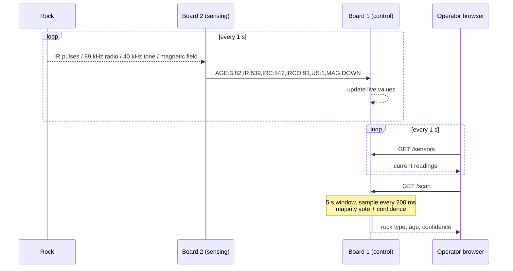

[← Documentation index](README.md) · [Repo home](../README.md) · [Next: Infrared sensing →](02-infrared.md)

# 1. System Overview

## 1.1 Project objectives

The aim of the project was to design and build a remotely controlled lunar rover capable of manoeuvring a lunar terrain and surveying the rocks in the area. The rover determines each rock's age and type by detecting the radio, infrared, magnetic and ultrasonic signals the rock emits.

The rover is tested in a lab-controlled environment on a smooth surface. Large rocks must be driven around; smaller rocks are the scan targets. Two constraints shaped the whole design:

- **Mass under 750 g.** This ruled out heavier structural materials and pushed the chassis towards thin 3D-printed PLA plates.
- **3.3 V logic throughout.** The Metro M0's digital input pins are not 5 V tolerant, so every analogue front-end runs from the Metro's regulated 3.3 V rail. No level shifting or protection dividers are needed anywhere between a sensor board and a microcontroller pin.

## 1.2 The four rock types

Each rock transmits its age over radio, and encodes its type in three further signals:

| Rock type | Infrared pulse rate | Ultrasound (40 kHz) | Magnetic polarity |
|---|---|---|---|
| **Basaltoid** | 547 Hz | Present | Down |
| **Gravion** | 312 Hz | Absent | Down |
| **Regolix** | 312 Hz | Present | Up |
| **Lunarite** | 547 Hz | Absent | Up |

Read as a truth table, any **two** of the three columns uniquely identify all four types. The rover measures all three anyway. The redundancy is deliberate: the third sensor cross-checks the other two, and the degree of agreement between them becomes the **confidence score** shown to the operator. A rock that reads cleanly scores high; one where a sensor flickers scores low, which is precisely the signal telling the operator to reposition and rescan.

> Rock ages arrive as four ASCII characters beginning with `#`. `#123` means 1.23 billion years.

## 1.3 System architecture

The system splits across two Adafruit Metro M0 Express boards (SAMD21, 48 MHz Cortex-M0+):

**Board 2 — sensing.** Runs all four sensor subsystems and nothing else. Infrared pulses are counted on a hardware interrupt, the demodulated radio bitstream is read by the hardware UART on pin 0, the ultrasonic envelope is polled as a digital level, and the magnetometer is read over I²C. Once a second it packs everything into one CSV line and sends it to Board 1.

**Board 1 — control.** Carries the WINC1500 Wi-Fi shield, serves the mission control web page, drives the two motors through an H-bridge, and runs the rock classification over the readings streamed from Board 2.

The link between them is a one-way hardware UART on SERCOM1 at 9600 baud — two wires, TX to RX plus a shared ground.

## 1.4 Signal chain summary

Every analogue subsystem follows the same broad shape — pick up a weak signal, amplify it hard, reduce it to something a digital pin can read — but the details differ enough to be worth stating side by side:

| | Infrared | Radio | Ultrasound |
|---|---|---|---|
| Sensor | SFH300 phototransistor | 120-turn ferrite coil | Prowave 400SR160 |
| Raw signal | ~µA current pulses | tens of mV at 89 kHz | ~150 mV pk-pk at 40 kHz |
| Amplifier | Inverting, ×100 (MCP6022) | Non-inverting, ×101 (MCP6022) | Two non-inverting stages, ×34 each (MCP6022) |
| Filtering | Band-pass, 159 Hz – 48 kHz | Tuned LC at 89 kHz | Transducer's own 2.5 kHz bandwidth |
| Digitising | LM393 comparator | LM393 comparator / Schmitt trigger | None — envelope drives the pin directly |
| Read by | Hardware interrupt, pin 2 | Hardware UART, pin 0, 600 baud | `digitalRead()` with a debounce counter |

The magnetic subsystem is the exception: the SEN0619 module performs its own amplification and conversion and reports over I²C, so it needs no analogue circuitry at all.

## 1.5 Where things live in this repository

| Concern | Location |
|---|---|
| Flight firmware, Board 1 | [`Full_Board_Code/Board 1/`](../Full_Board_Code/Board%201/) |
| Flight firmware, Board 2 | [`Full_Board_Code/Board 2/`](../Full_Board_Code/Board%202/) |
| Single-board prototype | [`Lonely_Board/`](../Lonely_Board/) |
| Per-sensor test firmware | [`sensing/`](../sensing/) |
| KiCad projects and Gerbers | [`sensing/PCBs/`](../sensing/PCBs/) |
| Web interface firmware | [`software/Website/rover_website/`](../software/Website/rover_website/) |

---

[← Documentation index](README.md) · [Repo home](../README.md) · [Next: Infrared sensing →](02-infrared.md)
