[← System overview](01-system-overview.md) · [Documentation index](README.md) · [Repo home](../README.md) · [Next: Radio sensing →](03-radio.md)

# 2. Infrared Sensing

**Measures:** rock type, via pulse rate
**Output:** 312 Hz or 547 Hz, plus a confidence figure
**Firmware:** [`sensing/Infrared/ir_test_code/`](../sensing/Infrared/ir_test_code/) (test), [`Full_Board_Code/Board 2/`](../Full_Board_Code/Board%202/) (flight)

---

## 2.1 The signal

Each rock emits infrared pulses **50 µs wide** at one of two average rates: **312 Hz** or **547 Hz**. The emission follows a Poisson distribution, so the pulses are not evenly spaced and the measured rate is approximate rather than exact. Any measurement scheme therefore has to average over a reasonable window rather than time a single interval.

Pulses are picked up with an **SFH300 phototransistor**, chosen because:

- its spectral response covers the 950 nm wavelength the rock emits;
- it is low cost and was readily available;
- it operates from a 3.3 V supply;
- it is available in a package that suits both breadboard and PCB.

---

## 2.2 Design

### Virtual ground

The circuit runs from a single 3.3 V supply, so there is no negative rail for the op-amp output to swing into. A virtual ground fixes this.

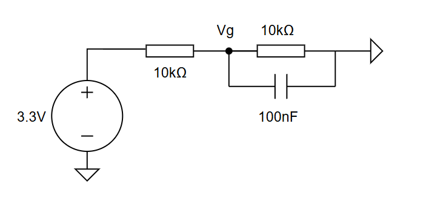

Two 10 kΩ resistors form a potential divider producing approximately 1.5 V at `Vg`, which becomes the new baseline in place of 0 V. The 100 nF capacitor shunts AC to ground so that only a clean DC reference reaches the op-amp.

3.3 V was chosen as the supply because it is the maximum voltage the Metro M0's input pins tolerate — powering the analogue chain from the same rail means its output can never exceed that limit, however hard it clips.

### Modelling the phototransistor

Before building anything, the phototransistor was simulated as a current source driving an NPN transistor:

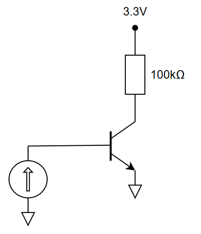

The source parameters mirror the real signal: **1 µA** amplitude (representing the sensor covered by the rock), **50 µs** on-time to match the pulse width, and a **3.2 ms** period to give a 312 Hz rate. The NPN converts the current pulses into voltage pulses that can then be amplified.

### Amplification

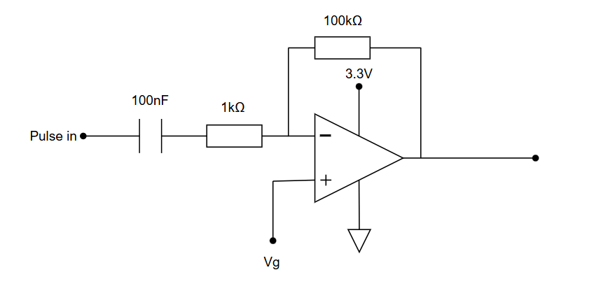

An inverting amplifier built around the **MCP6022** provides a gain of 100:

$$A = \frac{R_1}{R_2} = \frac{100\ \text{k}\Omega}{1\ \text{k}\Omega} = 100$$

The series input capacitor blocks the DC bias so only the pulse content is amplified.

The MCP6022 was selected because:

- its **10 MHz gain-bandwidth product** comfortably exceeds the ~20 kHz bandwidth the 50 µs pulses require;
- its 2.5–5.5 V supply range includes 3.3 V;
- it is power efficient and lightweight.

### High-pass filter

Mains-derived background at 100 Hz sits close enough to the 312 Hz pulse rate to matter, so a high-pass stage removes it.

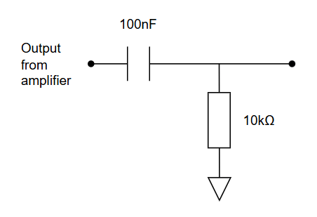

$$f_c = \frac{1}{2\pi \times 100\ \text{nF} \times 10\ \text{k}\Omega} = 159\ \text{Hz}$$

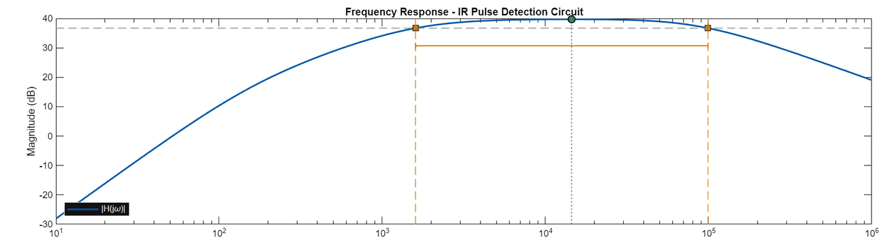

---

## 2.3 Implementation and measurement

### Digitising with a comparator

The amplified signal is still analogue and noisy. An **LM393** comparator converts it to clean logic levels, chosen for its **1.3 µs propagation delay** (fast enough for 50 µs pulses), its low cost, and its ability to run from 3.3 V and 0 V rails.

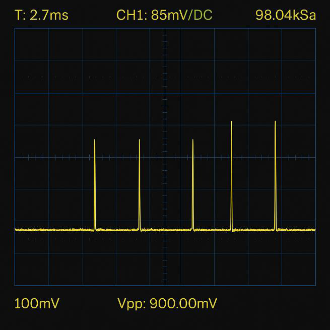

From the measured amplitude, the threshold was initially set by a 27 kΩ / 1 kΩ divider:

$$V_T = 3.3 \times \frac{1\ \text{k}}{27\ \text{k} + 1\ \text{k}} = 118\ \text{mV}$$

This low threshold meant pulses were still detected when the sensor was not quite touching the rock.

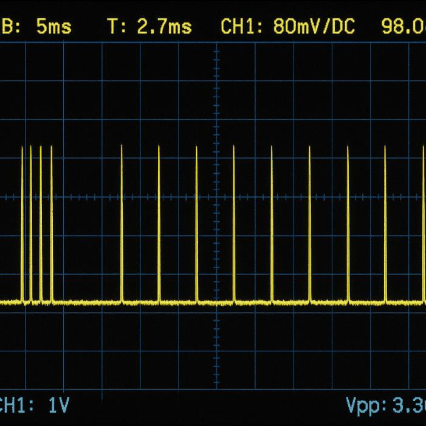

### Two problems, two fixes

Zooming in on a single pulse showed noisy edges caused by high-frequency oscillation:

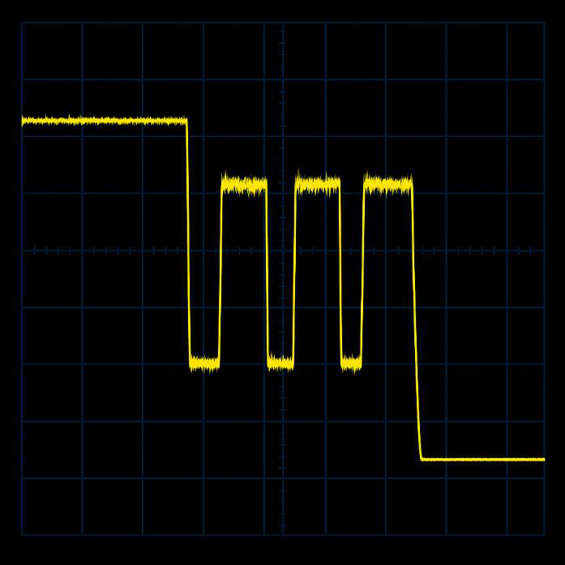

**Fix 1 — a low-pass filter** to roll off the high-frequency content:

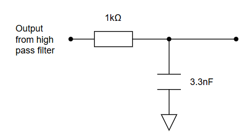

$$f_c = \frac{1}{2\pi \times 3.3\ \text{nF} \times 1\ \text{k}\Omega} = 48\ \text{kHz}$$

48 kHz sits comfortably above the ~20 kHz content of the pulses, so it smooths the edges without swallowing pulses. Combined with the earlier high-pass stage this gives a band-pass response from 159 Hz to 48 kHz:

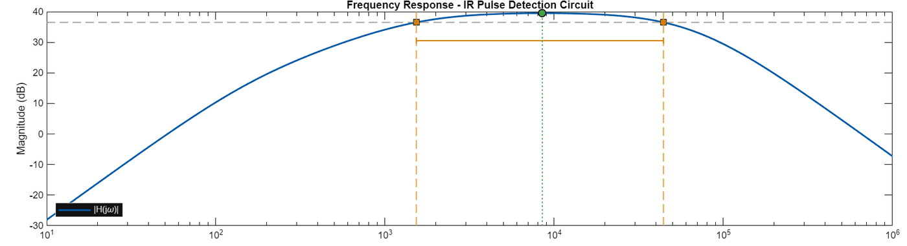

Even so, some noise-triggered pulses survived:

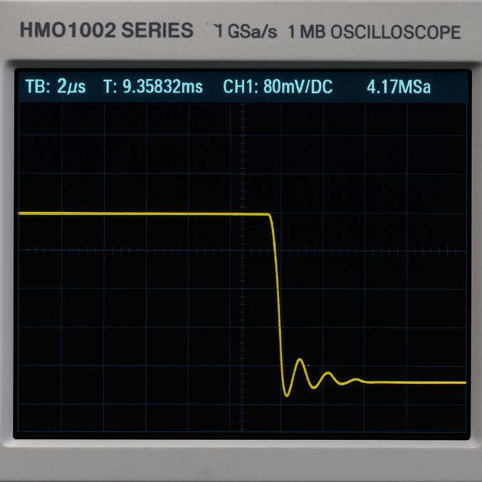

**Fix 2 — raise the threshold.** Replacing the 27 kΩ resistor with 5.1 kΩ gives:

$$V_T = 3.3 \times \frac{1}{3 + 1} = 825\ \text{mV}$$

This is still below the ~900 mV signal peak, so genuine pulses are detected — at the cost of a shorter detection range. That trade was accepted: the sensor arm places the IR sensor close to the rock anyway.

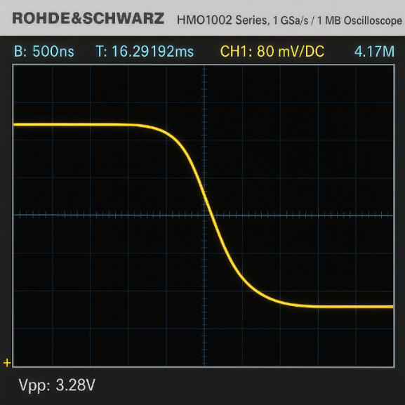

### Final circuit

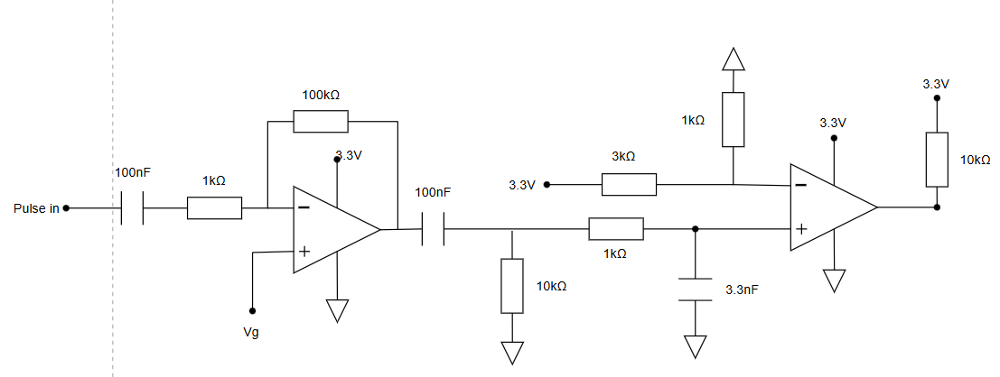

---

## 2.4 Software

The digitised pulse train drives **interrupt pin 2** on the Metro. Every rising edge fires an interrupt that increments a counter, so pulses are caught regardless of what the main loop is doing.

The rate is measured over **five consecutive 200 ms windows**. Each window's count is multiplied by 5 to give a per-second rate, and the five results are averaged. Averaging this way means a single anomalous window — a missed pulse burst, or a spurious trigger — cannot dominate the reading.

Board 2 then classifies the averaged rate as whichever of 312 Hz or 547 Hz it is nearer to, and reports both the raw rate (`IR`), the classification (`IRC`) and a confidence percentage (`IRCO`) derived from how decisively the rate fell on one side of the midpoint.

### Test results

| Test | Expected | Run 1 | Run 2 | Run 3 |
|---|---|---|---|---|
| 1 | 312 Hz | 281 | 328 | 279 |
| 2 | 547 Hz | 530 | 514 | 518 |
| 3 | 547 Hz | 511 | 505 | 499 |
| 4 | 312 Hz | 289 | 310 | 303 |

Every reading falls clearly on the correct side of the ~450 Hz decision boundary, with the worst case (279 Hz against an expected 312 Hz) still more than 170 Hz clear of it. The consistent slight undercount is expected from the Poisson emission statistics over a finite window.

---

## 2.5 Component summary

| Component | Part | Role |
|---|---|---|
| Photodetector | SFH300 | 950 nm phototransistor |
| Amplifier | MCP6022 | Inverting, ×100 |
| Comparator | LM393 | Analogue → logic level |
| High-pass | 100 nF + 10 kΩ | 159 Hz, rejects 100 Hz background |
| Low-pass | 3.3 nF + 1 kΩ | 48 kHz, smooths edges |
| Threshold divider | 5.1 kΩ + 1 kΩ | 825 mV |

---

[← System overview](01-system-overview.md) · [Documentation index](README.md) · [Repo home](../README.md) · [Next: Radio sensing →](03-radio.md)
