[← Infrared sensing](02-infrared.md) · [Documentation index](README.md) · [Repo home](../README.md) · [Next: Ultrasound sensing →](04-ultrasound.md)

# 3. Radio Sensing

**Measures:** rock age
**Output:** age in billions of years, e.g. `#382` → 3.82
**Firmware:** [`sensing/radio/radio_test_code/`](../sensing/radio/radio_test_code/) (test), [`Full_Board_Code/Board 2/`](../Full_Board_Code/Board%202/) (flight)
**Calculations:** [`sensing/radio/COIL_CALCULATIONS.md`](../sensing/radio/COIL_CALCULATIONS.md)

---

## 3.1 The signal

The rock transmits its age on an **89 kHz carrier** using **amplitude-shift keying** — specifically on-off keying, where carrier present means logic `1` and carrier absent means logic `0`. The data is standard **UART framing at 600 baud**: one start bit (logic `0`), eight data bits LSB first, one stop bit (logic `1`).

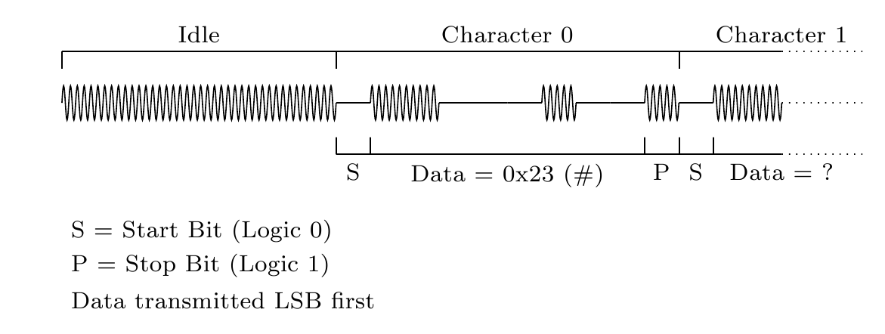

An age is four ASCII characters, the first always `#`. `#123` means 1.23 billion years.

| Bit | 0 | 1 | 2 | 3 | 4 | 5 | 6 | 7 | 8 | 9 |
|---|---|---|---|---|---|---|---|---|---|---|
| Value | 0 (start) | 1 | 1 | 0 | 0 | 0 | 1 | 0 | 0 | 1 (stop) |

### Recovery chain

Getting from a faint magnetic field to a decoded number takes five stages:

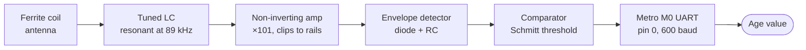

Development followed the same order: LTspice simulation first, then a physical circuit, then connection to the Metro M0.

---

## 3.2 Antenna

A **hand-wound ferrite-core coil** was used rather than an air core. Ferrite raises inductance substantially for the same turn count and physical size, concentrating the magnetic field and improving sensitivity to weak signals — and it does so at lower weight than the equivalent air-core coil would need.

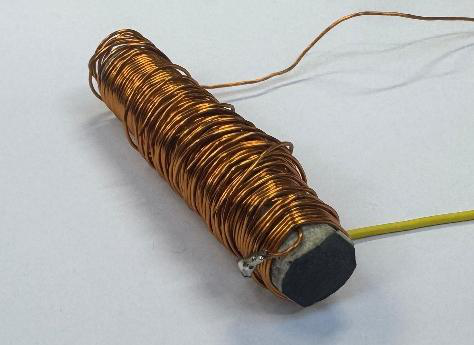

| Parameter | Value |
|---|---|
| Core material | Ferrite |
| Core diameter | 1 cm |
| Core length | 5.5 cm |
| Turns | 120 |
| Wire | 0.40 mm copper |

### Calculated versus measured

Full working is in [`COIL_CALCULATIONS.md`](../sensing/radio/COIL_CALCULATIONS.md). In summary:

Baseline air-core inductance from the solenoid formula, with an end-effect correction $K = 0.859$ for the short coil, gives $L_0^{corrected} = 22.2\ \mu\text{H}$. The ferrite rod's *effective* permeability is far lower than its bulk value because flux leaks at the rod ends:

$$\mu_{eff} = \frac{\mu_{bulk}}{1 + N_d(\mu_{bulk} - 1)} = \frac{125}{1 + 0.044 \times 124} \approx 19.3$$

$$L_{theoretical} = 19.3 \times 22.2 \approx 429\ \mu\text{H}$$

| | Theoretical | Measured | Difference |
|---|---|---|---|
| Inductance | 429 µH | 517 µH | ~85 µH (~17%) |
| Resistance | 0.52 Ω | 0.488 Ω | — |

The ~17% inductance gap is unsurprising given that $\mu_{bulk}$ and $N_d$ were both typical values rather than measured ones. **The measured 517 µH is what the tuning capacitor was sized against**, not the theoretical figure.

### Tuning to resonance

$$f_0 = \frac{1}{2\pi\sqrt{LC}} \implies C = \frac{1}{(2\pi f_0)^2 L}$$

At 89 kHz with $L = 517\ \mu\text{H}$, $C = 6.18\ \text{nF}$. Built from real capacitors in series and parallel this became **6.6 nF**.

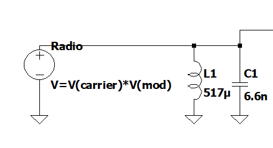

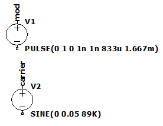

`V_carrier` is an 89 kHz sine of 50 mV amplitude; `V_mod` is a 600 Hz square pulse train.

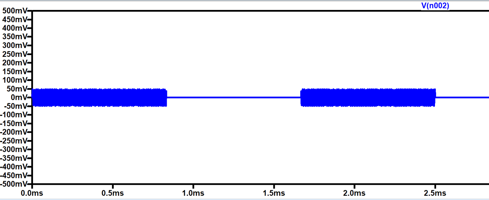

The simulation shows the expected on-off keyed waveform. On the bench the amplitude was roughly **9× larger** than simulated — measured about 2 cm from the coil and perpendicular to it. Received amplitude varies dramatically with both distance and orientation, which is why the simulation figure should be read as a lower bound rather than a prediction.

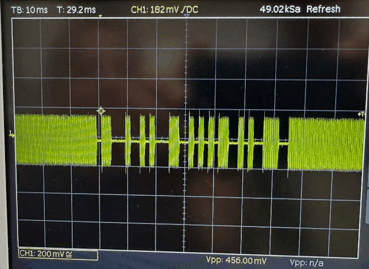

---

## 3.3 Amplification

The received signal can be as low as a few tens of millivolts. A **non-inverting amplifier with a gain of about 100** was used, deliberately sized so the output clips against the supply rails. The rails are 0 V to 3.3 V, so the negative half of the input is clipped away — which costs nothing, since the following envelope detector discards it anyway.

$$A = \frac{R_2 + R_1}{R_1} = \frac{100\ \text{k} + 1\ \text{k}}{1\ \text{k}} = 101$$

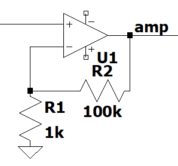

### Why not the MCP6002

The **MCP6002** was the obvious first choice — rail-to-rail, 1.8–6 V, and readily available. It was rejected on two grounds:

1. Its **1 MHz gain-bandwidth product** limits usable gain at 89 kHz to roughly ×11, which would have needed several cascaded stages.
2. Its slew-rate-versus-temperature curve showed marginal performance even at 25 °C and 5.5 V, with worse behaviour expected at the 3.3 V the design actually runs at.

| | MCP6002 | MCP6022 |
|---|---|---|
| GBW | 1 MHz | 10 MHz |
| Slew rate | ~0.6 V/µs | 7 V/µs |
| Max gain at 89 kHz | ~11× | ~112× |

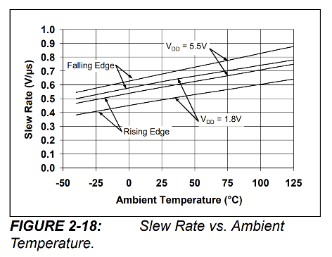
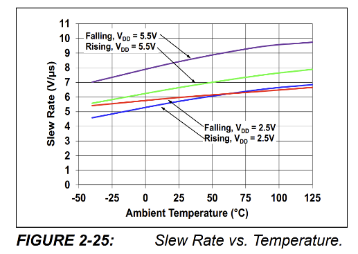

Bench testing confirmed the prediction, and the **MCP6022** was selected.

### Results

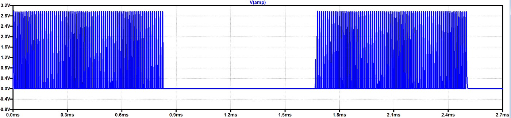

The simulation shows 50 mV amplified to a rail-clipped 0–3 V output with the negative half removed, and the 1.67 ms bit period confirms 600 bits/s.

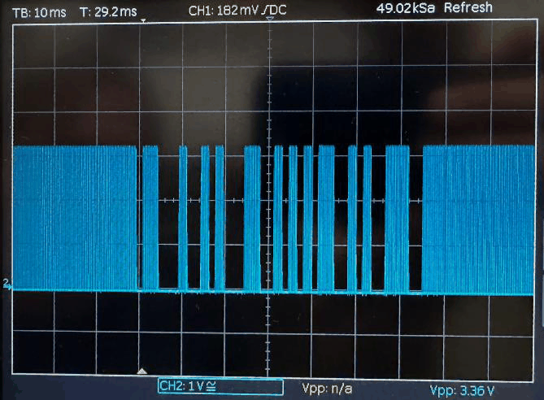
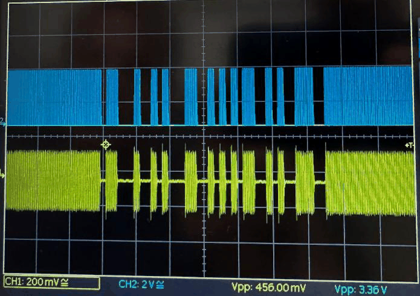

On the bench the measured gain was $3.36 / 0.456 = 7.47$ — far below the nominal 101. This is *not* a design failure: the op-amp is saturating against the 3.3 V rail, and the input signal was much larger than 50 mV because the rock sat close to the antenna. The gain figure is meaningless once the output is clipping, which is exactly the intended operating condition.

---

## 3.4 Envelope detection

The amplified output is still a sine wave. The Metro needs the *envelope* of that wave, not the wave itself. A diode, capacitor and resistor do the job: the diode charges the capacitor while the carrier is present, and the resistor discharges it while the carrier is absent.

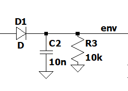

Two constraints govern the design:

**The diode drop.** A silicon diode costs about 0.6 V, so the amplifier must drive well above that before the detector sees anything. With ×100 gain this is satisfied even for a 50 mV input.

**The RC cutoff.** The filter must reject the 89 kHz carrier while passing the 600 bit/s data. With $R = 10\ \text{k}\Omega$ and $C = 10\ \text{nF}$:

$$\tau = 100\ \mu\text{s} \implies f_c = 1.59\ \text{kHz}$$

That sits more than an order of magnitude below 89 kHz and above 600 Hz — comfortably inside the window.

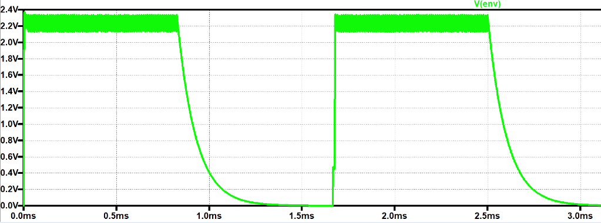
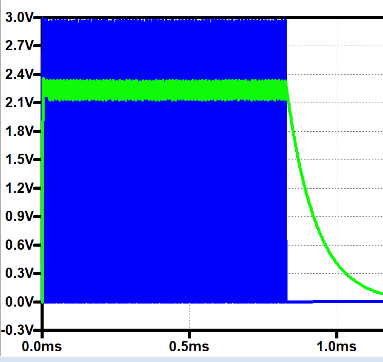

The simulation shows the half-wave rectified signal becoming a near-digital envelope, ~0.6 V below the amplified signal as expected from the diode. Zooming in reveals the ripple caused by the capacitor discharging on each negative half-cycle:

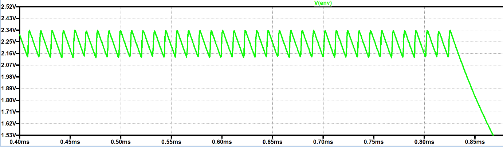

Raising R to 30 kΩ makes the point about time constants concretely — the capacitor no longer fully discharges before the next cycle:

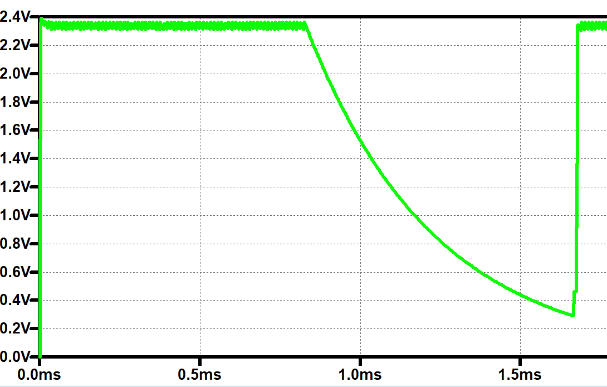

This matters directly for the comparator stage that follows.

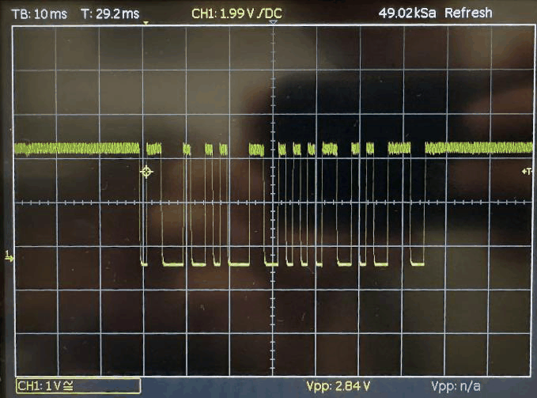
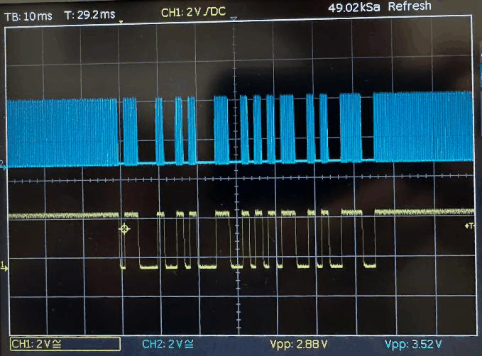

The measured peak-to-peak difference between the two traces is $3.52 - 2.88 = 0.64\ \text{V}$ — the diode drop, as predicted.

---

## 3.5 Comparator / Schmitt trigger

The final analogue stage removes the ripple on each "on" cycle and squares off the capacitor's finite discharge time.

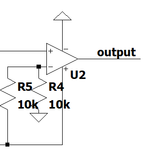

This is a non-inverting comparator — the signal enters the `+` terminal — with R4 and R5 dividing $V_{cc}$ to set the threshold, nominally at half supply (~1.65 V).

Threshold selection is the critical trade-off:

- **Too low** and noise alone triggers the output.
- **Too high** and the signal fails to cross it at greater rock-to-antenna distances, where the amplifier output no longer reaches 3.3 V.

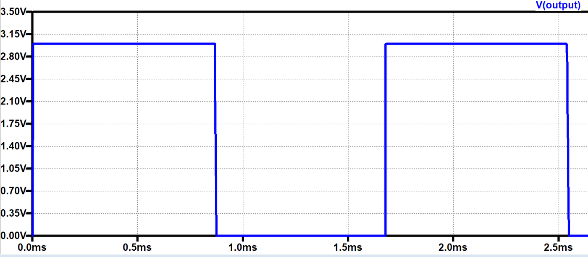

The simulated output is a clean digital signal swinging 0 V to 3 V.

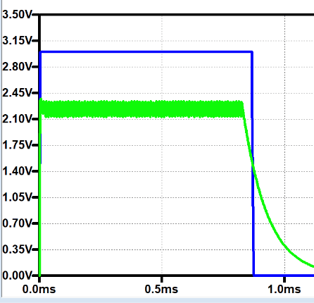

Three things are worth noticing in this overlay. The ripple is gone. The output no longer carries the 0.6 V diode drop. And the signal does **not** fall to 0 V when you would naively expect — the traces cross at around 1.6 V, meaning the capacitor must discharge for a finite time before the threshold is reached.

That last point has a real consequence: the comparator alters $T_{on}$ and $T_{off}$, even though their sum still equals the bit period. Both must stay inside the tolerances the Metro's UART peripheral will accept, or framing errors follow.

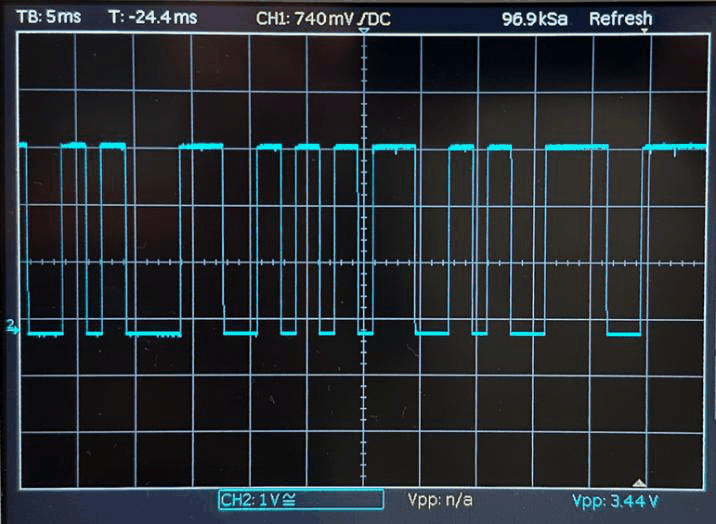
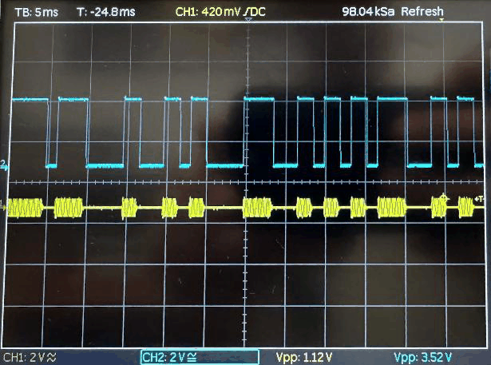

The bench measurement backs the simulation up: minimal ripple, and amplitude restored to 3.44 V.

---

## 3.6 Final circuit

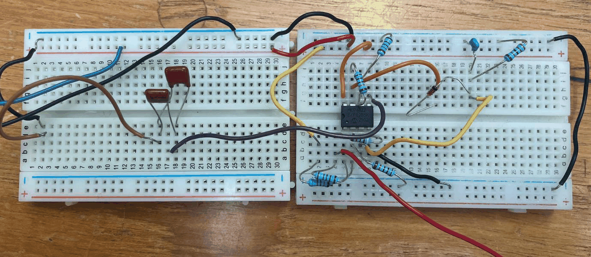

Each stage is visible left to right: antenna tuning capacitors, amplifier, envelope detector, Schmitt trigger. The antenna coil itself sits away from the board for better reception.

> **One non-obvious addition.** A **1 kΩ series resistor** sits between the comparator output and the Metro input pin. Without it, the Metro's internal protection diodes back-drive the comparator output, clamping the signal so it never reaches a full 0–3.3 V swing.

---

## 3.7 Software

The demodulated output feeds the Metro's **hardware UART on pin 0**, which decodes the 600 baud stream autonomously without processor intervention. The firmware:

1. watches the incoming byte stream for the `#` start character;
2. buffers the following three ASCII digits;
3. divides the resulting integer by 100 to give the age in billions of years;
4. **clears the stored age after 5 seconds of silence**, so a value from a previous rock can never be attributed to the next one scanned.

That timeout is small but important — without it the rover would confidently report the last rock's age while parked at an unresponsive one.

---

## 3.8 Reflections

**Inverting versus non-inverting.** Cascading an inverting amplifier with a non-inverting Schmitt trigger (or vice versa) silently inverts the data, which then has to be undone in firmware. Making every stage non-inverting removed that class of bug entirely.

**Threshold in practice.** LTspice assumes a noise-free environment and a constant 50 mV input, neither of which holds on the bench. The threshold was lowered from the simulated half-supply value to about **0.75 V** so the comparator still triggers at greater distances, accepting increased noise susceptibility as the price.

**Antenna orientation.** Induced EMF varies sinusoidally with the angle between transmitting and receiving coils — the signal peaks when the coils are perpendicular and vanishes when they are parallel. Orientation matters as much as proximity, so the antenna angle was tuned during testing and then fixed by the mechanical arm design (see [Mechanical design](06-mechanical-design.md#radio-arm)).

---

[← Infrared sensing](02-infrared.md) · [Documentation index](README.md) · [Repo home](../README.md) · [Next: Ultrasound sensing →](04-ultrasound.md)
