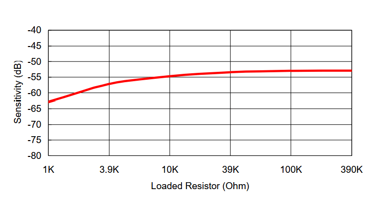
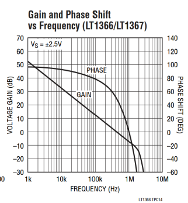
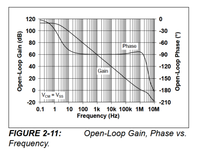
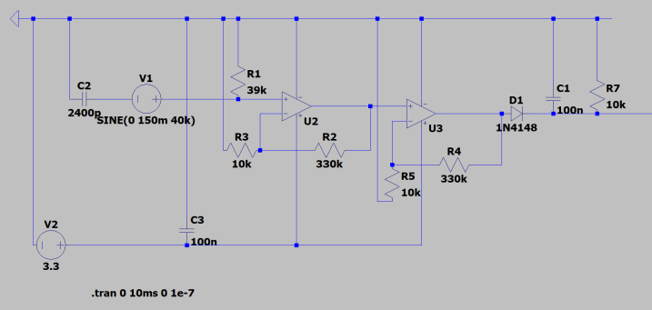
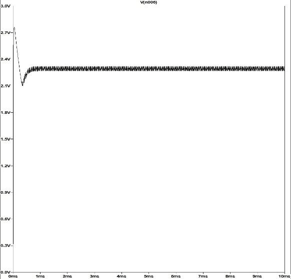
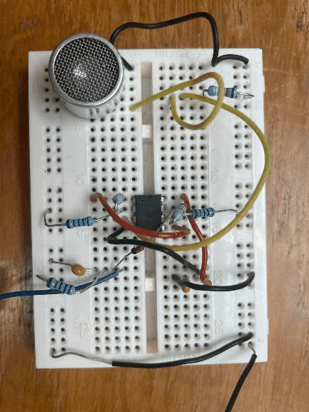
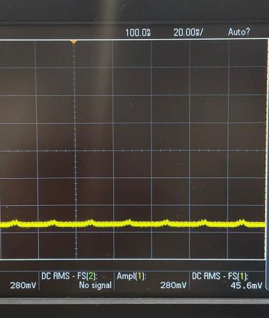
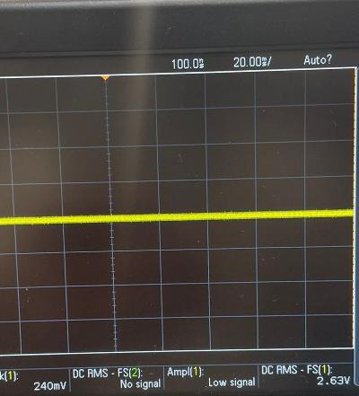

[← Radio sensing](03-radio.md) · [Documentation index](README.md) · [Repo home](../README.md) · [Next: Magnetic field sensing →](05-magnetic-field.md)

# 4. Ultrasound Sensing

**Measures:** rock type, via presence of a 40 kHz tone
**Output:** present / absent
**Firmware:** [`sensing/ultrasonic/ultrasonic_test_code/`](../sensing/ultrasonic/ultrasonic_test_code/) (test), [`Full_Board_Code/Board 2/`](../Full_Board_Code/Board%202/) (flight)
**Design notes:** [`sensing/ultrasonic/Ultrasonic_sensor_notes.md`](../sensing/ultrasonic/Ultrasonic_sensor_notes.md)

---

## 4.1 The signal

Of the four rock types, **Basaltoid and Regolix emit a continuous 40 kHz ultrasonic tone**; Gravion and Lunarite do not. This turns a four-way classification into a binary question.

That framing is what makes the whole subsystem simple. No distance measurement is needed, no amplitude, no phase — only a reliable yes/no that a digital pin can read. Every design decision below follows from taking that constraint seriously rather than building a general-purpose ultrasonic receiver.

---

## 4.2 Transducer

The standard component for the job is a piezoelectric transducer. Two requirements narrowed the field: a centre frequency of exactly 40 kHz, and a *receiver* rather than a transmitter.

The **Prowave 400SR160** met both — the `SR` designation stands for Sound Receiver. Its open-type housing exposes the piezoelectric element directly, giving higher sensitivity than a sealed design at some cost in durability. It was also commonly available in the department labs, avoiding both budget spend and delivery delay.

| Parameter | Value |
|---|---|
| Centre frequency | 40.0 ± 1.0 kHz |
| Receiving sensitivity (0 dB = 1 V/µbar) | −61 dB minimum |
| Capacitance at 1 kHz | 2400 pF ± 20% |
| Bandwidth (−6 dB) | 2.5 kHz |
| Beam angle (−6 dB) | 55° typical |
| Operating temperature | −30 to +70 °C |

The −61 dB sensitivity figure sets the whole design:

$$V_{out} = 10^{-61/20} \times 1\ \text{V/µbar} \approx 0.00089\ \text{V/µbar}$$

Millivolt-level output — amplification is unavoidable.

### Load resistor

The datasheet plots sensitivity against load resistance:

Sensitivity improves markedly from 1 kΩ up to roughly 39–100 kΩ, then plateaus. **39 kΩ** was chosen as the transducer load to ground: near-maximum sensitivity without unnecessarily large component values.

The transducer's narrow 2.5 kHz bandwidth is a bonus here — it rejects acoustic energy at other frequencies before any electronics are involved.

---

## 4.3 Amplifier

A **non-inverting** topology was chosen for its high input impedance, which avoids loading the transducer, and for straightforward gain setting with two resistors.

### Op-amp selection

Three parameters mattered:

- **Supply range** must include 3.3 V, since that is what the Metro's digital pins run at.
- **Rail-to-rail output**, to make full use of the available swing.
- **Gain-bandwidth product**, because usable gain at any frequency is limited by $A_{max}(f) = \text{GBW} / f_{signal}$. At 40 kHz, $A_{max} = \text{GBW} / 40{,}000$.
- **Slew rate.** For a 40 kHz sine of 3 V peak-to-peak, $dV/dt_{max} = 2\pi f A = 2\pi \times 40{,}000 \times 1.5 \approx 0.38\ \text{V/µs}$. A minimum of ~1 V/µs was targeted for margin.

| Op-amp | Slew rate | GBW | Gain at 40 kHz | Verdict |
|---|---|---|---|---|
| LT1366 | 0.25 V/µs | — | ~20× | Too slow |
| MCP6002 | 0.6 V/µs | 1 MHz | ~26× | Used initially |
| MCP6022 | 7 V/µs | 10 MHz | ~250× | **Selected** |

The MCP6002 was used first. After one was damaged during testing it was replaced with the **pin-compatible MCP6022** — a drop-in swap that brought 10× the bandwidth and far more slew headroom with no circuit changes at all.

### Gain

The amplifier is **deliberately designed to clip** at the supply rail rather than reproduce the signal faithfully. The reasoning is in [§4.5](#45-why-hard-clipping-is-the-right-choice).

To drive the weakest expected signal (~30 mV, at the edge of range where the tone passes through the rock's housing) all the way to the 3.3 V rail:

$$A_{total,min} = \frac{3300\ \text{mV}}{30\ \text{mV}} = 110\times$$

Split across two identical stages that is $\sqrt{110} \approx 10.5\times$ each. A substantially higher gain was chosen so the output still clips reliably at the edge of range:

$$A = 1 + \frac{R_f}{R_1} = 1 + \frac{330\ \text{k}\Omega}{10\ \text{k}\Omega} = 34\times$$

Total gain $34 \times 34 = 1156\times$. The 330 kΩ feedback resistor was picked over 220 kΩ (which would give only 23×) specifically to widen this clipping margin.

The only constraint is bandwidth:

$$f_{-3\text{dB}} = \frac{\text{GBW}}{A} = \frac{10\ \text{MHz}}{34} \approx 294\ \text{kHz}$$

Roughly 7× above the 40 kHz signal, so the extra gain costs nothing at the frequency that matters.

A **100 nF decoupling capacitor** sits across each op-amp supply pin to ground to suppress rail noise.

### Input biasing, deliberately omitted

A textbook single-supply AC amplifier biases the input to mid-rail (~1.65 V) so the output swings symmetrically without the negative half clipping at 0 V. That was left out on purpose: the following stage is a half-wave envelope detector that passes only the positive half-cycle and discards the negative half regardless. Biasing would add components for no functional benefit.

---

## 4.4 Envelope detection

The amplifier output is a large 40 kHz waveform, but a digital pin can extract nothing useful from 40 kHz AC — it needs a steady DC level meaning "present" or "absent".

A **1N4148 diode, 10 kΩ resistor and 100 nF capacitor** do this. The diode passes positive half-cycles to charge the capacitor; the resistor discharges it when the signal disappears.

$$\tau = R \times C = 10\ \text{k}\Omega \times 100\ \text{nF} = 1\ \text{ms} \quad (f_c \approx 159\ \text{Hz})$$

This is **40× longer than one 40 kHz period** (25 µs), so the capacitor barely discharges between cycles and the output is smooth DC. It still settles within about 5 ms — effectively instant at the timescale of a 5-second scan.

Accounting for the ~0.6 V diode drop, the output is roughly **2.6 V when the tone is present** and **~0 V when it is absent**.

---

## 4.5 Why hard clipping is the right choice

High gain saturating the op-amp output would be unacceptable in an audio design. Here it is actively beneficial, for a specific reason:

**The envelope detector charges from the *peak* of the waveform, and a clean sine and a heavily clipped square wave share the same peak voltage.** They therefore produce the same envelope output.

Clipping consequently makes the circuit insensitive to signal strength. Whether the transducer sees 30 mV at the edge of range or 150 mV up close, both saturate to the same rail voltage and yield the same DC level. The detection decision stops depending on distance.

Two components were considered and rejected as a direct result:

- **A precision rectifier**, which would remove the diode drop. Unnecessary — since the output already clips, the 0.6 V drop is a fixed, predictable offset that needs no compensation.
- **A dedicated comparator.** Also unnecessary. The Metro M0's digital input reads anything above ~1.8 V as HIGH and below as LOW. An envelope swinging between ~2.6 V and ~0 V leaves roughly 1 V of margin at each end.

---

## 4.6 Simulation

The simulation settles to a steady ~2.3 V after a brief startup transient, against ~2.6 V measured on the bench. The 0.3 V difference is immaterial — both sit well above the 1.8 V HIGH threshold.

---

## 4.7 Implementation and results

With the 39 kΩ load in place, the transducer's raw output measured around **150 mV pk-pk** with a 40 kHz signal present at close range. Each stage was verified on the oscilloscope before the next was added:

| Node | Output with 40 kHz signal present |
|---|---|
| Transducer + 39 kΩ load | ~150 mV pk-pk |
| Stage 1 amplifier (×34) | ~3.1 V — clips at supply rail |
| Stage 2 amplifier (×34) | ~3.1 V — fully clipped |
| Envelope detector output | ~2.6 V DC |
| Metro digital input | Logic HIGH |

Both captures use 1 V vertical divisions. The absent case reads ~45.6 mV; the present case ~2.63 V.

---

## 4.8 Software

The receiver output is read with `digitalRead()`, since the detection circuitry has already reduced it to a logic level.

To reject transient noise and brief dropouts, a **bidirectional counter** is used: it increments on each HIGH reading up to a ceiling of 5, and decrements on each LOW reading down to 0. Detection is confirmed when the counter reaches 5 and cleared when it returns to 0. A single spurious sample in either direction cannot flip the state.

Samples are taken every **20 ms** using non-blocking `millis()` timing, so ultrasonic monitoring runs concurrently with everything else on Board 2.

---

[← Radio sensing](03-radio.md) · [Documentation index](README.md) · [Repo home](../README.md) · [Next: Magnetic field sensing →](05-magnetic-field.md)
