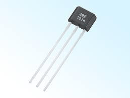
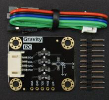
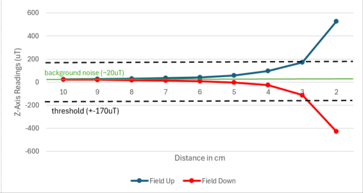

[← Ultrasound sensing](04-ultrasound.md) · [Documentation index](README.md) · [Next: Mechanical design →](06-mechanical-design.md)

# 5. Magnetic Field Sensing

**Measures:** rock type, via magnet polarity
**Output:** `UP` / `DOWN` / `UNKNOWN`
**Firmware:** [`sensing/magnetic/Magnetic_test_code/`](../sensing/magnetic/Magnetic_test_code/) (test), [`Full_Board_Code/Board 2/`](../Full_Board_Code/Board%202/) (flight)

---

## 5.1 The problem

Each rock contains a small permanent magnet pointing either up or down, splitting the four types into two pairs:

| Polarity | Rock types |
|---|---|
| **Down** | Basaltoid, Gravion |
| **Up** | Regolix, Lunarite |

What is needed is reliable detection of **field direction** — the sign of the vertical (Z-axis) field — not an accurate measurement of its strength.

The difficulty is geometric. The sensor sits on the rover's arm and must detect the magnet through an air gap and the rock's outer wall, at a distance of **a few centimetres** rather than on contact. This subsystem is the clearest example in the project of a requirement that looks trivial and turns out to drive a complete change of technology.

---

## 5.2 First attempt — AH49E Hall-effect sensor

A linear Hall-effect sensor is the obvious starting point. Its output sits at half the supply voltage with no field applied and swings above or below that midpoint according to field direction — polarity is encoded directly as a voltage, with no processing needed.

The **AH49E** was chosen after rejecting two alternatives:

| Part | Why rejected |
|---|---|
| Allegro A1302 | Needs 4.5–6 V, incompatible with the 3.3 V rail; also obsolete |
| Honeywell SS49E | Out of stock and overpriced |
| **AH49E** | **Selected** — runs from 3.3 V, breadboard-friendly TO-92 |

Datasheet sensitivity is 1.6 mV/G at 5 V, scaling to about **1.06 mV/G** on a 3.3 V rail.

### Why it failed

On contact it worked well. Touching the magnet directly onto the sensor face swung the output by roughly **±400 mV**. At the actual 3–4 cm gap between chassis and rock, the change vanished into the noise.

The arithmetic explains why. A magnet's field falls off with the **cube** of distance ($B \propto 1/r^3$), so moving from ~5 mm to ~40 mm is an 8× increase in distance and a **512× drop in field**:

$$\Delta V \approx \frac{400\ \text{mV}}{512} \approx 0.78\ \text{mV}$$

The Metro's 10-bit ADC resolves only $3.3\ \text{V} / 1024 \approx 3.2\ \text{mV}$ per step. A 0.78 mV change is **less than a single ADC count** — invisible, and buried in supply noise besides.

### Why amplification did not rescue it

A ×10 inverting amplifier (MCP6002) referenced to the sensor's quiescent voltage was built to try to recover the signal. It made no real difference, for a reason worth stating plainly:

**Amplifying the signal amplifies the noise by the same factor.** The signal-to-noise ratio is unchanged. Once the true signal sits below the noise floor, no amount of gain brings it back.

This was the point at which it became clear that Hall effect was the wrong *technology* for the required range, not merely the wrong *part*.

---

## 5.3 Switching to a magnetometer

The fix was a sensor built for fields of this magnitude. Digital magnetometer modules are designed to measure the Earth's field (~50 µT), making them orders of magnitude more sensitive than a Hall sensor. They also perform amplification and analogue-to-digital conversion on the module and report over I²C — removing exactly the analogue circuitry that had cost the team time.

The **DFRobot SEN0619** (Bosch **BMM350**) was selected. It uses tunnelling magnetoresistance — measuring changes in electrical resistance caused by quantum electron tunnelling — and resolves **0.1 µT**.

| Sensor | Technology | Sensitivity / resolution | Verdict |
|---|---|---|---|
| AH49E | Hall effect | ~1.06 mV/G at 3.3 V | Range too short — fails beyond ~5 mm |
| A1324 | Hall effect | ~3.3 mV/G | Better, still far too insensitive |
| KMZ51 | Magnetoresistive | 16 mV/G | Sensitive, but SMD-only with a complex bridge and supply |
| GY-271 (QMC5883L) | Magnetoresistive | ~0.1 µT | Suitable digital module |
| **BMM350 (SEN0619)** | **TMR** | **0.1 µT** | **Selected** |

The BMM350's 0.1 µT resolution is roughly **3000× finer** than the AH49E-plus-ADC combination (~300 µT effective), comfortably covering the ~500× shortfall the distance calculation predicted, with margin to spare.

> **Resolution is not range.** The key distinction is between *resolution* — the smallest detectable change — and *range* — the largest measurable field before saturation. The AH49E had ample range (±100 mT) but far too coarse an effective resolution at distance (~300 µT per ADC step). The BMM350 is the opposite: 0.1 µT resolution across a ±2000 µT range. That is precisely the shape this application needs.

---

## 5.4 Integration

Because all signal conditioning happens on the module, **no external circuitry is required**. The SEN0619 runs from 3.3 V at about 200 µA and connects directly to the Metro's I²C bus at address `0x14` — 3.3 V logic, no level shifting, internal pull-ups.

Two interference sources were considered:

- **The drive motors.** The magnetometer responds directly to their changing field, so it was mounted as far from them as the arm geometry allowed. In practice the rover is stationary during a scan anyway, so the motors are not running when the reading is taken.
- **The radio antenna's ferrite core.** Expected to interfere, but measured to have negligible effect during testing.

---

## 5.5 Software and classification

The sensor is read using the **DFRobot_BMM350** library in normal mode, taking the Z-axis field in µT. Direction is decided from the sign of Z, with a dead band to ignore background field:

| Z-axis reading | Field direction | Rock types |
|---|---|---|
| Z > +170 µT | Up | Regolix or Lunarite |
| −170 to +170 µT | None / too far | Inconclusive |
| Z < −170 µT | Down | Basaltoid or Gravion |

### Choosing ±170 µT

During testing the background reading sat between roughly **15 and 40 µT** (the Earth's field plus local noise). Bringing the sensor near anything mildly magnetic could push it to **100–120 µT**.

The lunar arena should contain no such objects, but the threshold was set to **170 µT** to stay well clear of those spurious spikes while remaining far below the much larger signal the rock's magnet produces at detection range. The result is a wide margin on both sides.

The outcome is sent to Board 1 inside the sensor packet as `MAG:UP`, `MAG:DOWN` or `MAG:UNKNOWN`.

---

## 5.6 Results

On the bench the SEN0619 reliably detected the supplied magnet from about **7 cm** — against the ~5 mm the AH49E managed, a roughly 14× improvement in working range.

With the magnet field-up at less than a centimetre, the Z reading went well above 1000 µT, comfortably past the threshold; reversing the magnet gave the corresponding reading of opposite sign. This confirmed both that polarity detection worked and that the margin either side of the ±170 µT threshold is wide enough for all four rock types to classify reliably.

---

## 5.7 What this subsystem cost, and what it taught

The AH49E route consumed two sensors (£0.76) and a meaningful amount of bench time before being abandoned. The lesson generalises beyond this project: **when a signal is below the noise floor, the problem is sensing technology, not gain.** Recognising that earlier — by doing the $1/r^3$ calculation before ordering rather than after building — would have gone straight to the magnetometer.

---

[← Ultrasound sensing](04-ultrasound.md) · [Documentation index](README.md) · [Next: Mechanical design →](06-mechanical-design.md)
