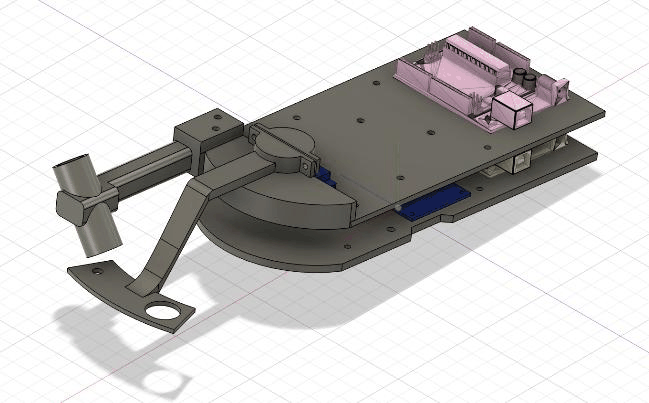
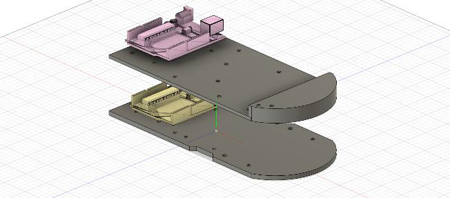
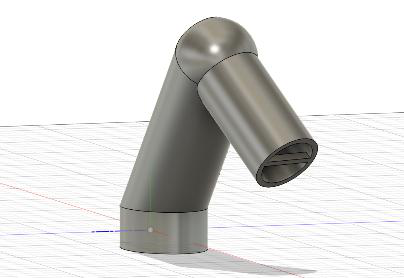
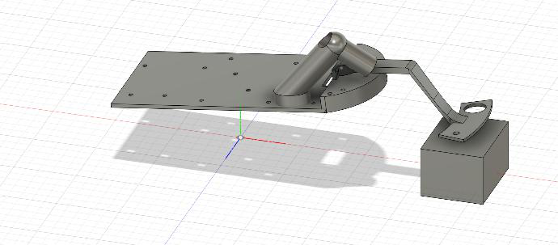
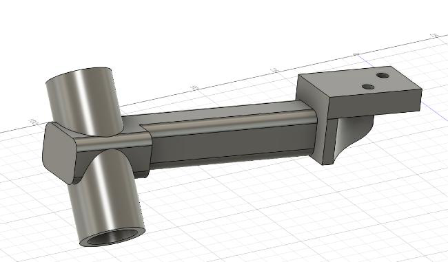
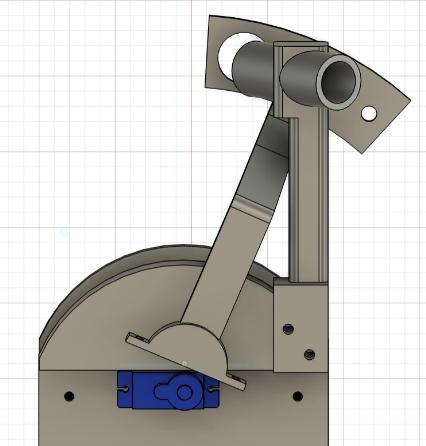
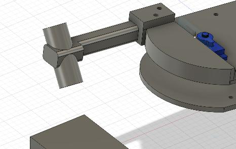
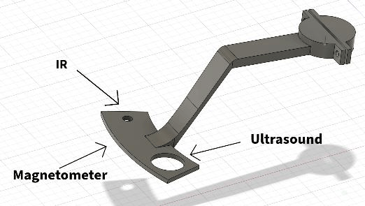
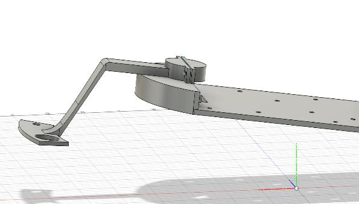
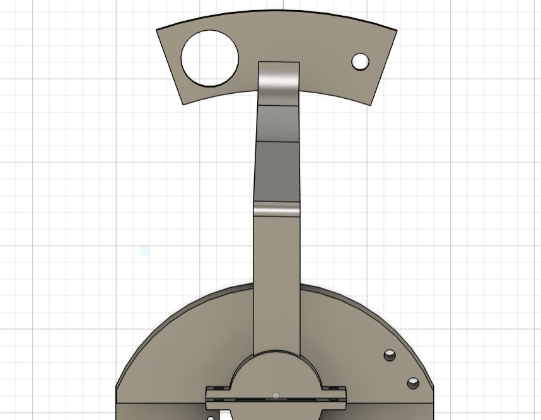

[← Magnetic field sensing](05-magnetic-field.md) · [Documentation index](README.md) · [Next: Movement and control →](07-movement-and-control.md)

# 6. Mechanical Design — Chassis and Sensor Arm

**Designed in:** Fusion 360
**Printed in:** PLA
**Actuator:** SER0047 metal-geared servo

---

## 6.1 Overview

The chassis is the structural core of the rover, built as a **two-plate stack** with each plate handling a distinct set of functions:

| Plate | Carries |
|---|---|
| **Lower (base) plate** | Drive motors, motor driver module, power supply, Board 1 |
| **Upper (sensor) plate** | Sensor PCBs, radio antenna arm, rotating sensor arm, Board 2 |

The two plates are separated by spacers, with wiring running between them.

---

## 6.2 Requirements

The chassis must:

- carry both plates, the rotating and radio arms, the power supply, both boards and all circuitry **without measurable flex**;
- let the sensor arm sweep across a rock **without turning the whole rover**;
- provide rigid, accurately placed mounting points so nothing shifts under motor vibration.

The most important constraint, though, is **noise isolation**. DC-motor commutation and PWM transients must not couple into the sensors. Two subsystems are particularly exposed:

- **The magnetometer**, which responds directly to the motors' changing magnetic field.
- **The radio**, which — although its 89 kHz tuned coil rejects most out-of-band noise — can still pick up interference through its high gain.

Both are therefore kept physically separated from the motors. This requirement, more than any other, dictated the layout.

---

## 6.3 Dual-plate layout

The PCBs holding the sensor circuitry are screwed directly to the sensor plate through mounting holes, and both Metro boards are mounted at the rear of the chassis to keep the inter-board wiring short and easy to route.

### Material choice

The department offered **PLA** and **TPU**. TPU was rejected because its flexibility would let the plates deform under load and during motion — unacceptable for a structural frame that must hold components tightly in place.

PLA was chosen despite being relatively brittle and prone to some flex under sustained load. That limitation was addressed by making the plates thick enough to stay stiff rather than sag under the components mounted on them.

### Dimensions

| Parameter | Value | Reasoning |
|---|---|---|
| Plate width | 95 mm | — |
| Plate length | 205 mm | Arced front end |
| Plate separation | 35 mm | Clears the tallest component below while keeping sensors at a useful height |
| Base plate thickness | 4 mm | Supports motors *and* the entire sensor plate above it |
| Sensor plate thickness | 3 mm | Carries only lighter circuitry and the arm — saves weight and print time |

Both plates share an almost identical outline so they stack evenly, with the base plate including notches for the motors. Component dimensions were measured with callipers so that mounting holes and cut-outs in the CAD model matched each part precisely.

> **The 35 mm separation could not be set in CAD beforehand.** The wheels caused the chassis to tilt, making the true ground clearance hard to predict. The spacing was measured directly once both plates were printed and the wheels fitted — a case where the physical build had to inform the model rather than the other way round.

---

## 6.4 Sensor mounting

The sensor plate holds **two separate mounting structures**: a fixed arm for the radio antenna, and a rotating arm carrying the other three sensors. Keeping them separate was deliberate, for two reasons:

1. **The radio does not need aiming.** Its range is much larger than the other sensors', so there is no benefit to sweeping it across the rock.
2. **The radio antenna is heavy.** It uses an iron core with the inductor coil wound around it, and a PLA rotating arm would not reliably support that weight while turning.

Giving the radio its own fixed, sturdy arm removes both problems at once.

### Radio arm

The arm is angled so the coil points **downward toward the rock** rather than straight ahead, which matters because induced EMF depends on the angle between transmitting and receiving coils (see [Radio § reflections](03-radio.md#38-reflections)). Because the radio's detection range is relatively large, the antenna does not need to sit close to the rock.

An early version was **glued rather than screwed** and, once test-fitted, sat too high above the rock:

The redesign is screwed down through mounting holes and sits at the correct height:

Its only cost is restricting the sensor arm's rightward sweep to **23° from centre** — which still covers enough of the rock to be useful:

### Sensor arm

The rotating arm carries the three remaining sensors and sweeps them across the rock, so each measurement can be taken while the rover itself stays still.

The magnetometer is fixed to the underside of the arm; the infrared and ultrasonic sensors mount through holes spaced along it, so all three point down toward the rock.

**Why sweep at all?** The infrared and magnetic signals are strongest at one point on the rock and very weak elsewhere. Sweeping lets each sensor find the position where its signal is strongest, rather than depending on a single fixed reading that might miss the source entirely or return a corrupted value.

### Sensors follow the sweep arc

Rather than sitting in a straight line, the sensors are arranged **along the arc the servo sweeps the arm through**, so that each one's path crosses the same target point near the centre of the rock.

This matters most for the infrared and magnetic sensors, which must pass very close to the signal source to record a reliable value. A straight-line arrangement would put the outer sensors on paths that never cross the target.

### Servo selection

The arm is driven by a servo mounted on the sensor plate, with its wires running down to the board on the base plate. The **SER0047** was chosen over the cheaper plastic-geared servos initially available, for three reasons:

| Reason | Detail |
|---|---|
| **Torque** | ~0.15 N·m stall torque at 6 V — enough to move the loaded arm and hold it steady against its own weight, even at the ends of the sweep |
| **Durability** | Metal gears, far more resistant to wear than plastic |
| **Power** | Low current draw, so it runs from the rover's existing supply without a separate source |

### Arc support platform

The sensor plate is raised on a platform with an **arced upper surface** that follows the path the arm traces as it rotates. The arm therefore stays supported at every angle rather than overhanging at the extremes.

This does two things: it holds the arm at a **consistent height above the rock across the whole sweep**, giving more consistent readings; and it takes the arm's weight off the servo, so the motor does not have to support the arm on its own.

---

## 6.5 Photographs still needed

The CAD renders above document the design intent. Photographs of the built rover would show how it actually turned out — the two are not the same thing, and a reader evaluating this project will want both.

> **📸 `images/mechanical/rover-assembled.jpg`**
> The fully assembled rover, three-quarter view, showing both plates, wheels, arms and wiring. This is the single most valuable missing image — it belongs at the top of the root README.

> **📸 `images/mechanical/rover-side-profile.jpg`**
> Side-on view showing the 35 mm plate separation and the sensor arm's height above the ground.

> **📸 `images/mechanical/rover-scanning-rock.jpg`**
> The rover parked at a rock mid-scan, with the sensor arm swept over it. Demonstrates the working geometry better than any render.

> **📸 `images/mechanical/sensor-arm-built.jpg`**
> Close-up of the printed sensor arm with the IR, ultrasonic and magnetometer sensors fitted.

> **📸 `images/mechanical/chassis-underside.jpg`**
> Underside of the base plate showing motor mounting and the notches.

See [images/README.md](images/README.md) for the complete list across all subsystems.

---

[← Magnetic field sensing](05-magnetic-field.md) · [Documentation index](README.md) · [Next: Movement and control →](07-movement-and-control.md)
