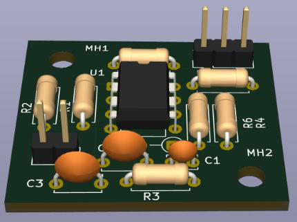
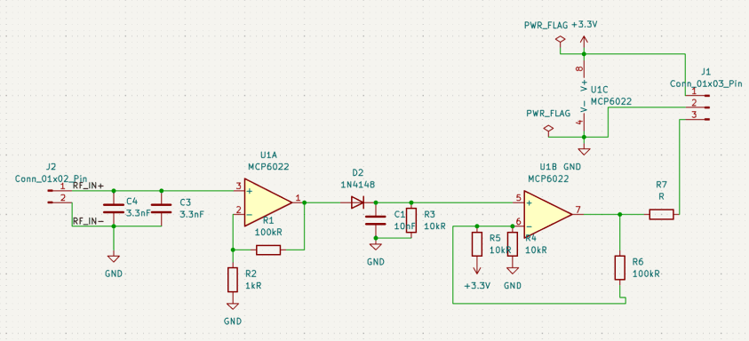
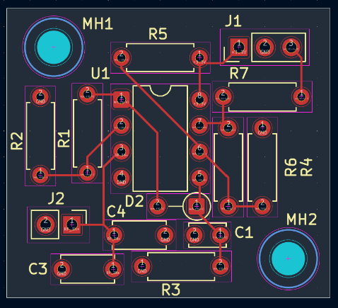
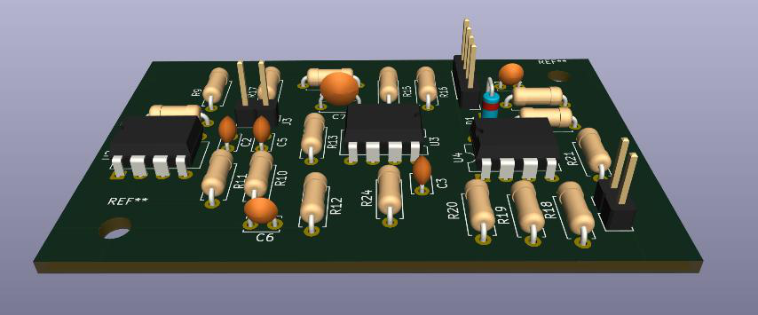
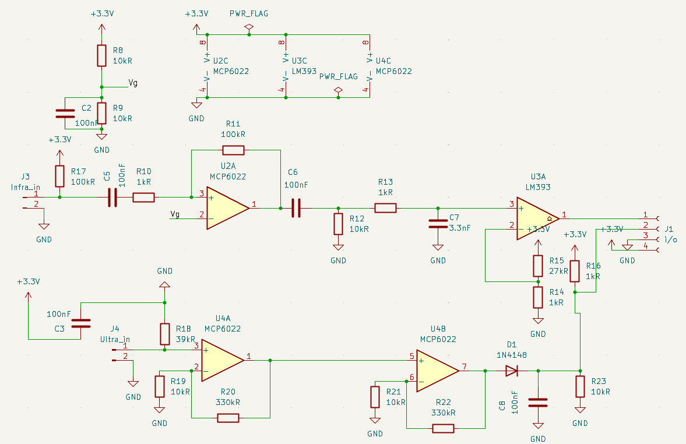
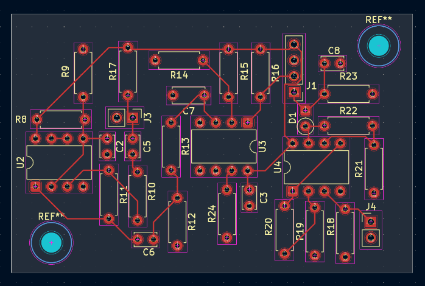
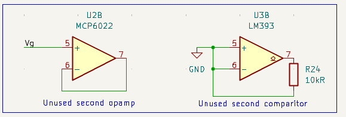
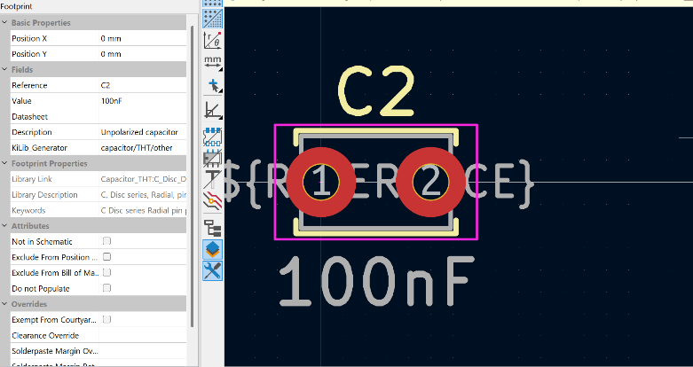

[← Movement and control](07-movement-and-control.md) · [Documentation index](README.md) · [Repo home](../README.md) · [Next: Web interface →](09-web-interface.md)

# 8. PCB Design

**Tool:** KiCad
**Boards:** two — radio, and infrared + ultrasound combined
**Files:** [`sensing/PCBs/`](../sensing/PCBs/)

---

## 8.1 Overview

Moving from breadboard to PCB is the step that turns a prototype into reliable hardware. Two boards were produced:

| Board | Contains | Source |
|---|---|---|
| **Radio** | Antenna tuning, amplifier, envelope detector, comparator | [`sensing/PCBs/Radio PCB/`](../sensing/PCBs/Radio%20PCB/) |
| **IR + Ultrasound** | Both analogue chains, sharing a board | [`sensing/PCBs/IR + ultrasound/`](../sensing/PCBs/IR%20+%20ultrasound/) |

**Why two boards rather than one?** The split gives a clean boundary between subsystems, simplifies debugging, and allowed the two chains to be developed and tested independently.

It is worth being explicit that electromagnetic interference was **not** the driving factor. Even the highest frequency involved — the 89 kHz radio carrier — is low by EMI standards. The split was made for practical rather than electrical reasons.

**No PCB was needed for magnetic sensing.** The SEN0619 module delivers a digital output over I²C and connects directly to the Metro board (see [Magnetic field sensing](05-magnetic-field.md#54-integration)).

### Supply and output

The boards are powered from **3.3 V rather than 5 V**, because the Metro M0 operates on 3.3 V logic and applying 5 V to its digital inputs would exceed their absolute maximum rating.

This choice pays off twice. Powering the op-amp and comparator from 3.3 V means their output **can never exceed the Metro's input limit**, even at full rail-to-rail swing — so no potential divider or protection circuitry is needed between the PCB output and the microcontroller.

The output header exposes the UART signal, 3.3 V and GND, allowing direct connection to the Metro M0 while leaving room for test equipment and additional components.

---

## 8.2 Radio board

Manufacturing files: [`sensing/PCBs/Radio final PCB/`](../sensing/PCBs/Radio%20final%20PCB/) (Gerbers and drill files).

---

## 8.3 Infrared + ultrasound board

Manufacturing files: [`sensing/PCBs/Infrared final pcb/`](../sensing/PCBs/Infrared%20final%20pcb/).

---

## 8.4 Unused op-amp and comparator channels

Both the **MCP6022** and **LM393** are dual-channel devices, and only one channel of each is used.

The unused channels cannot simply be left floating. Unconnected inputs pick up noise and cause unpredictable oscillation, which then couples interference into the *active* channel through the shared supply — degrading the very circuit the device is there to serve.

| Device | Channel | Treatment |
|---|---|---|
| MCP6022 | U2B | Configured as a **voltage follower**, non-inverting input tied to the `Vg` bias voltage — holds the output at a stable DC level |
| LM393 | U3B | Both inputs tied to **GND**, with a 10 kΩ pull-up (R24) on the open-collector output to prevent it floating |

Both follow standard practice for handling unused amplifier channels.

---

## 8.5 Footprint selection

Choosing the right footprint for each component is easy to get wrong and expensive to discover after manufacture. Physical component dimensions were measured with a **Vernier calliper** and matched against the available KiCad libraries rather than assumed from part numbers.

---

## 8.6 Layout rules applied

The layout was created by defining the board outline, placing components, and then routing.

### Avoiding right-angle traces

Right-angle traces cause electromagnetic fields to bunch at the corner, generating interference and acting as unintended antennas. **45° routing** was used throughout.

### Ground plane

A copper ground plane was applied to the back layer, providing a low-impedance return path for current and shielding against electromagnetic interference.

### Trace width

A uniform trace width was used throughout. Given the low current levels in the analogue signal chain, a single default width was sufficient everywhere without risk of overheating.

### Avoiding long parallel tracks

Long parallel runs were minimised to reduce capacitive coupling between signals, preserving signal integrity in the analogue chain.

### Component placement

Components were placed to keep signal paths short and ordered logically from input to output, reducing trace length and minimising interference.

---

## 8.7 Manufacturing files

| Board | KiCad project | Gerbers |
|---|---|---|
| Radio | [`sensing/PCBs/Radio PCB/`](../sensing/PCBs/Radio%20PCB/) | [`sensing/PCBs/Radio final PCB/`](../sensing/PCBs/Radio%20final%20PCB/) |
| IR + ultrasound | [`sensing/PCBs/IR + ultrasound/`](../sensing/PCBs/IR%20+%20ultrasound/) | [`sensing/PCBs/Infrared final pcb/`](../sensing/PCBs/Infrared%20final%20pcb/) |
| Demo board | [`sensing/PCBs/Demo pcb/`](../sensing/PCBs/Demo%20pcb/) | [`sensing/PCBs/Final files greber/`](../sensing/PCBs/Final%20files%20greber/) |

Each Gerber set contains front and back copper, front and back solder mask, front silkscreen, edge cuts, and both plated and non-plated drill files — everything a fabricator needs.

---

## 8.8 Photographs still needed

> **📸 `images/pcb/pcb-radio-populated.jpg`**
> The manufactured radio board with components soldered in place.

> **📸 `images/pcb/pcb-ir-ultrasound-populated.jpg`**
> The manufactured IR + ultrasound board, populated.

> **📸 `images/pcb/pcbs-mounted-on-chassis.jpg`**
> Both boards screwed to the sensor plate and wired to the Metro — showing the transition from the renders above to the finished rover.

---

[← Movement and control](07-movement-and-control.md) · [Documentation index](README.md) · [Repo home](../README.md) · [Next: Web interface →](09-web-interface.md)
