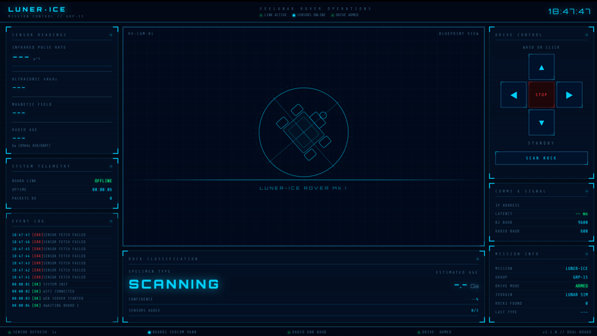
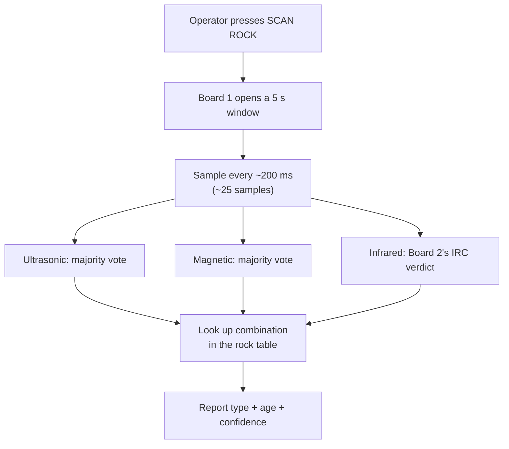

[← PCB design](08-pcb-design.md) · [Documentation index](README.md) · [Repo home](../README.md) · [Next: Dual-board architecture →](10-dual-board-architecture.md)

# 9. Web Interface — Mission Control

**Served by:** Board 1, via a WINC1500 Wi-Fi shield
**Source:** [`software/Website/rover_website/src/main.cpp`](../software/Website/rover_website/src/main.cpp)
**Standalone preview:** [`software/eeerover_mission_control_demo.html`](../software/eeerover_mission_control_demo.html)

---

## 9.1 Overview

The rover is controlled and monitored entirely through a web page, so the operator needs nothing more than a browser on the same Wi-Fi network. Board 1 serves the page; the operator opens the rover's IP address, which Board 1 prints over the serial monitor when it joins the network.

A browser-based interface was chosen because it works on any laptop or phone and allows a responsive display to be built without writing a separate desktop program.

---

## 9.2 What the page shows, and why

The centre of the screen holds a stylised animated graphic of the rover. It is **purely aesthetic**, giving the interface identity — and it can afford the prime position precisely because everything around it stays readable.

Directly below sits the **rock classification panel**: type, age and scan confidence. This is the mission's real output. The confidence figure is what tells the operator whether to trust a result or rescan it.

Arranged around these are:

| Element | Purpose |
|---|---|
| Live sensor readings | IR rate, ultrasonic present/absent, magnetic direction, radio age — what the rover is picking up right now |
| Scan log | Timestamped record of scans and identifications |
| Link health | Latency and packets received, so a dropped connection is immediately obvious |
| Drive controls | Mode selector and on-screen movement buttons |

Everything besides the central graphic is either a key output or a way to judge that the system is working.

---

## 9.3 How the page talks to the rover

Reloading the whole page on every button press would flicker and briefly block further commands. Instead the page uses JavaScript `fetch()` calls, which send a request to Board 1 in the background and leave the page untouched — only the rover reacts.

The same mechanism refreshes the readings: once a second the page fetches the latest sensor values and updates the numbers on screen, with no operator input.

**Why once a second?** Two independent reasons converge on the same figure:

1. It matches how often Board 2 sends fresh data (~1 Hz). Polling faster would just re-fetch identical values.
2. Board 1 serves only one request at a time, so a modest poll rate keeps sensor fetches from queuing behind drive commands — the same class of problem that caused the [gamepad latency bug](07-movement-and-control.md#75-the-latency-problem-and-the-fix).

---

## 9.4 Serving the page

The whole Board 1 program fits comfortably in flash: about **38% of 256 KB** (~100 KB, mostly the Wi-Fi libraries and the page text) and only about **18% of 32 KB RAM**. The page is held as a string in flash, not RAM.

The real constraint is not storage but **transmission**. The WINC1500 module can only push a limited amount of data per transfer, and attempting to send the whole page in one go **crashes the driver**.

Board 1 therefore streams the page to the browser in **500-byte chunks**, which the browser reassembles. The 500-byte figure was arrived at by testing rather than derived — larger chunks were unreliable, smaller ones needlessly slow.

---

## 9.5 Drive control

The page can drive the rover from the keyboard (WASD) or on-screen buttons, each sending a `fetch()` to a movement route on Board 1, which then sets motor directions and speeds.

These controls were used mainly during early testing. The rover is now driven with a connected game controller — see [Movement and control](07-movement-and-control.md#74-gamepad-control).

---

## 9.6 Scanning a rock

Two facts shape the scan design:

- Sensor readings taken while the rover is moving between rocks are meaningless.
- A single instantaneous reading is easily thrown off by noise.

Classification is therefore **on demand**. The operator stops at a rock and presses **SCAN ROCK**, which starts a 5-second window on Board 1.

Over that window Board 1 collects repeated readings, settles the two on/off sensors (ultrasonic and magnetic) by **majority vote**, takes Board 2's infrared verdict, then looks the combination up to identify the rock.

The **confidence** shown is worked out from how decisive each sensor was during the scan. A clean rock reads high; a flickering one reads low. That is exactly what tells the operator whether to rescan. Full detail in [Dual-board architecture](10-dual-board-architecture.md#107-rock-classification).

---

## 9.7 Endpoints

| Route | Purpose |
|---|---|
| `GET /` | Serve the mission control page (chunked) |
| `GET /forward`, `/left`, `/right`, `/stop`, … | Discrete movement commands (keyboard and on-screen buttons) |
| `GET /drive?left=L&right=R` | Analogue drive from the gamepad; sign sets direction, magnitude sets PWM |
| `GET /sensors` | Current sensor values as parsed from Board 2's last packet |
| `GET /scan` | Begin a 5-second classification window |

---

## 9.8 Use of AI assistance

The web interface code was written with the help of an AI tool (Anthropic's Claude), given the complexity of the program required and the short timeframe available. The behaviour was specified by the team, and all code was reviewed, tested and debugged on the hardware.

---

[← PCB design](08-pcb-design.md) · [Documentation index](README.md) · [Repo home](../README.md) · [Next: Dual-board architecture →](10-dual-board-architecture.md)
