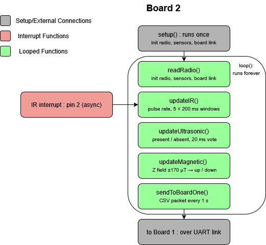
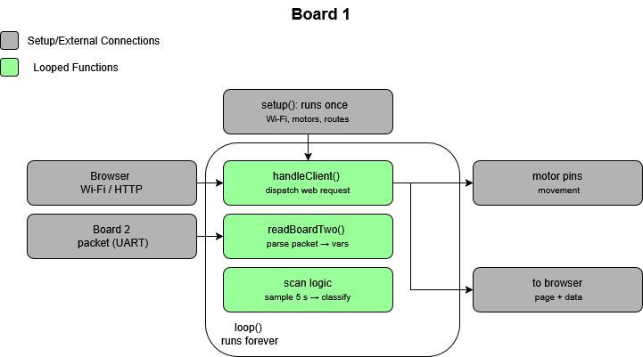

[← Web interface](09-web-interface.md) · [Documentation index](README.md) · [Next: Cost and bill of materials →](11-cost-and-bom.md)

# 10. Dual-Board Architecture

**Hardware:** two Adafruit Metro M0 Express boards (SAMD21, 48 MHz Cortex-M0+)
**Link:** one-way hardware UART on SERCOM1, 9600 baud
**Firmware:** [`Full_Board_Code/Board 1/`](../Full_Board_Code/Board%201/) and [`Full_Board_Code/Board 2/`](../Full_Board_Code/Board%202/)

---

## 10.1 Overview

| | Board 1 | Board 2 |
|---|---|---|
| **Role** | Control | Sensing |
| **Responsibilities** | Wi-Fi, web interface, motors, rock classification | Radio, infrared, ultrasonic, magnetic |
| **Shield** | WINC1500 Wi-Fi | — |
| **Data flow** | Receives | Sends |

Board 2 streams its readings to Board 1 over a one-way UART link. A single board **could** have run the whole system — using two was a deliberate design choice, and the reasoning is set out below.




---

## 10.2 Why two boards

It is worth being honest about this: a single Metro M0 could realistically have run the entire system.

- The 48 MHz Cortex-M0+ has ample compute for this workload.
- The time-sensitive inputs are already protected by hardware — infrared counting on an interrupt, the radio read into an interrupt-driven UART buffer, the motors on hardware PWM.
- Board 1 alone, running Wi-Fi, the web server, the motors and classification, uses only about **18% of its RAM and 38% of its flash**.

A working single-board implementation exists in this repository at [`Lonely_Board/`](../Lonely_Board/).

Two boards were chosen anyway, for three reasons:

### Timing isolation

Serving the page over the WINC1500 blocks the processor in bursts. Keeping all sensing on a board that never stops for Wi-Fi makes measurement timing **independent of network activity** — the web server can never stall a reading. This mirrors the standard practice of separating real-time from best-effort tasks.

This is the strongest of the three arguments. The infrared subsystem counts 50 µs pulses over 200 ms windows; a multi-millisecond Wi-Fi stall inside one of those windows would corrupt the rate directly.

### Parallel development

Splitting sensing from control and UI let the two halves be built and tested independently, which suited how the team divided the work.

### Added capability

The working inter-board link is a more capable design than a single sketch, and the clean split keeps each board's code simple and focused.

**The trade-off accepted** is the modest extra complexity of the inter-board connection and a small increase in weight — both of which proved manageable.

---

## 10.3 Choosing how the boards talk

Six options were considered:

| Option | Verdict |
|---|---|
| `Serial1`, two-way | **Rejected** — pin 0 (RX) is taken by the radio on Board 2 |
| `SoftwareSerial` (bit-banged UART) | **Rejected** — not supported on the SAMD21; it compiles but does not work |
| Wi-Fi (UDP/TCP between boards) | **Rejected** — adds latency, unreliable in a crowded exhibition hall, and overkill for a few bytes |
| I²C | **Rejected** — the magnetometer already owns the I²C bus |
| SPI | **Rejected** — the Wi-Fi shield already owns the SPI bus, and the bandwidth is not needed |
| **SERCOM hardware UART (one-way)** | **Selected** |

The pattern in those rejections is that every default peripheral was already committed to something else. SERCOM is what remained — and it turned out to be the right answer rather than merely the surviving one.

---

## 10.4 SERCOM UART

The SAMD21 has **six SERCOM (Serial Communication) modules**, each of which can act as a UART, SPI or I²C peripheral and be mapped to non-default pins. This is the manufacturer's intended mechanism for adding an extra hardware UART, so it gives a properly buffered, interrupt-driven port without the unreliability of software bit-banging.

**SERCOM1** was mapped to pins 10 (TX) and 11 (RX) using the `UART` class and `pinPeripheral()`, which tells the chip to route those pins through SERCOM rather than treating them as ordinary GPIO.

The physical link is two conductors:

```
Board 2 pin 10 (TX)  ──────▶  Board 1 pin 11 (RX)
Board 2 GND          ───────  Board 1 GND
```

It is one-way because Board 2 only ever sends; there is no need for a return wire.

> **An accident that turned out well.** Pin 0 on Board 1 was found to be dead, so receiving on pin 11 via SERCOM was necessary regardless. The flexible pin mapping turned a potential hardware blocker into a one-line firmware change.

---

## 10.5 Packet format

**Continuous streaming** was chosen over a request-response scheme. Request-response would need two-way communication, and Board 2 has no spare RX pin — the radio owns pin 0.

Board 2 therefore sends a packet once per second, and Board 1 parses every packet as it arrives, continuously updating the live sensor values shown to the operator. The scan state only decides whether those readings are *also* accumulated for classification.

Each packet is one newline-terminated CSV line:

```
AGE:3.82,IR:539,IRC:547,IRCO:93,US:1,MAG:DOWN
```

| Field | Meaning |
|---|---|
| `AGE` | Rock age in billions of years, decoded from the radio |
| `IR` | Raw infrared pulse rate in Hz |
| `IRC` | IR classification — the nearer of the two expected rates (312 or 547), or 0 for no rock |
| `IRCO` | IR confidence, 0–100% |
| `US` | Ultrasonic presence: 1 or 0 |
| `MAG` | Magnetic direction: `UP`, `DOWN` or `UNKNOWN` |

Board 1 reads all six fields. It uses `IRC` for the infrared high/low decision and the averaged `IRCO` as the infrared confidence, alongside `AGE`, `US` and `MAG`.

The format was chosen because it is easy to read and debug, easy to extend, and **self-synchronising**: the newline terminator means any partial packet — for example if Board 1 powers up mid-message — is simply discarded rather than misparsed.

**9600 baud is far more than enough.** At ~45 bytes per packet and 1 Hz, the link uses about **5%** of the ~960 bytes/s available.

---

## 10.6 Implementation

### Board 2 — sensing

Board 2 runs **entirely non-blocking**, so reading the radio buffer, polling the ultrasonic pin, reading the magnetometer over I²C and sending packets never hold each other up. Infrared uses a hardware interrupt on pin 2, so pulses are caught no matter what the loop is doing.

Keeping all of this on a board with no Wi-Fi workload is the timing isolation described above — sensing is never disturbed by bursts of network activity.

### Board 1 — control

Board 1 hosts the web interface, drives the motors through the H-bridge, and runs rock classification on the data it receives.

---

## 10.7 Rock classification

The four rock types each map to a unique combination of the three type-sensor outputs:

| Rock type | Infrared | Ultrasound | Magnetic |
|---|---|---|---|
| **Basaltoid** | 547 Hz | Present | Down |
| **Gravion** | 312 Hz | Absent | Down |
| **Regolix** | 312 Hz | Present | Up |
| **Lunarite** | 547 Hz | Absent | Up |

During a scan, Board 1 takes a sample roughly every **200 ms across a 5-second window** — about 25 samples.

- The two binary sensors (**ultrasonic** and **magnetic**) are resolved by **majority vote** over those samples.
- The **infrared** high/low decision is taken from Board 2's own IR classification (`IRC`).
- The three results are looked up against the table above to give the rock type.

### Confidence

The confidence figure shown to the operator is computed from the readings themselves:

| Sensor | Score |
|---|---|
| Ultrasonic | How one-sided the vote was — unanimous = 100%, an even split = 0% |
| Magnetic | Same |
| Infrared | Board 2's `IRCO` confidence, averaged across the scan |

The three are averaged into an overall percentage. A separate count reports how many of the three sensors were **clearly decisive**.

A clean rock therefore reads at high confidence, while a borderline or flickering sensor lowers the figure honestly — which is the point. A classifier that always reported certainty would be worse than useless here, because the operator would have no basis for deciding when to rescan.

A reference implementation of the lookup is in [`software/rock_classification.md`](../software/rock_classification.md).

---

## 10.8 Development setup

Both boards are kept as **separate PlatformIO projects** (`platform = atmelsam`, `framework = arduino`) in this shared repository.

```ini
lib_ignore = Adafruit TinyUSB Library
```

This directive is **required**. Without it the build hits a USB symbol conflict with the WiFi101 stack. It is present in both projects' `platformio.ini` and should not be removed.

---

## 10.9 Use of AI assistance

Given the system's complexity and the time available, some of the firmware was written with the help of an AI tool (Anthropic's Claude). The team specified the behaviour, then reviewed, tested and debugged all code on the hardware; the design and the understanding of it are the team's own.

---

[← Web interface](09-web-interface.md) · [Documentation index](README.md) · [Next: Cost and bill of materials →](11-cost-and-bom.md)
