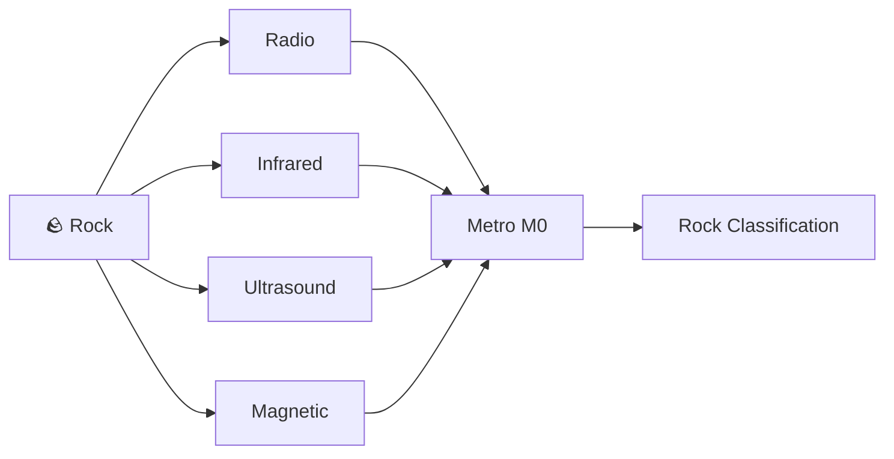

# Sensing

This folder contains the research, circuit design, and implementation notes for all sensing subsystems on the Luner-ICE rover.

Each subsystem is responsible for detecting a specific property of a rock and converting it into a digital signal for the Metro M0 to process.

---

## Subsystems

| Subsystem | Property Detected | Status |
|-----------|-------------------|--------|
| [Radio](./radio/) | Rock age via 89kHz ASK signal | ⏳ |
| [Infrared](./infrared/) | Rock type via pulse rate | ⏳ |
| [Ultrasound](./ultrasound/) | Rock type via 40kHz signal | ⏳ |
| [Magnetic](./magnetic/) | Magnetic pole orientation | ⏳ |

---

## How It All Fits Together

All five subsystems feed into the Metro M0 microcontroller on the rover. The rover drives up to a rock, each sensor takes a reading, and the combined data is used to classify the rock.

---

*Last updated: 2026-05-14*
