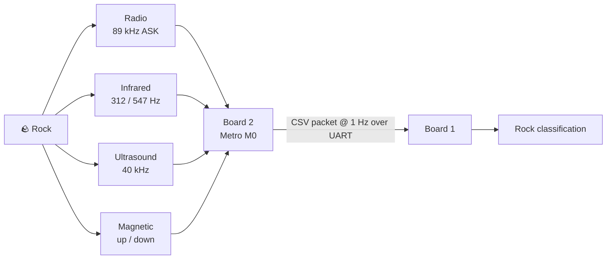

[← Repo home](../README.md) · [Technical documentation](../docs/README.md)

# Sensing

Research, circuit design, test firmware and PCB files for all four sensing subsystems on the Lunar-ICE rover.

Each subsystem detects one property of a rock and reduces it to a signal the Metro M0 can read. The full write-up for each — design reasoning, calculations, simulations and measurements — is in [`docs/`](../docs/); this folder holds the working files.

---

## Subsystems

| Subsystem | Detects | Documentation | Test firmware | Status |
|---|---|---|---|---|
| **Radio** | Rock age, via 89 kHz ASK | [docs/03-radio.md](../docs/03-radio.md) | [`radio/radio_test_code/`](radio/radio_test_code/) | ✅ Working |
| **Infrared** | Rock type, via pulse rate | [docs/02-infrared.md](../docs/02-infrared.md) | [`Infrared/ir_test_code/`](Infrared/ir_test_code/) | ✅ Working |
| **Ultrasound** | Rock type, via 40 kHz tone | [docs/04-ultrasound.md](../docs/04-ultrasound.md) | [`ultrasonic/ultrasonic_test_code/`](ultrasonic/ultrasonic_test_code/) | ✅ Working |
| **Magnetic** | Rock type, via magnet polarity | [docs/05-magnetic-field.md](../docs/05-magnetic-field.md) | [`magnetic/Magnetic_test_code/`](magnetic/Magnetic_test_code/) | ✅ Working |

---

## Folder contents

```
sensing/
├── Infrared/
│   └── ir_test_code/                  Pulse counting via hardware interrupt
├── radio/
│   ├── COIL_CALCULATIONS.md           Ferrite coil inductance and resistance working
│   ├── step1_coil_antenna.png         The wound coil
│   └── radio_test_code/               UART decode of the demodulated bitstream
├── ultrasonic/
│   ├── Ultrasonic_sensor_notes.md     Transducer, gain planning and test log
│   └── ultrasonic_test_code/          Digital-level presence detection
├── magnetic/
│   └── Magnetic_test_code/            BMM350 read over I²C
├── radio_ultrasound_magnetic/         Combined three-sensor integration test
└── PCBs/                              KiCad projects and manufacturing Gerbers
```

Each folder containing a `platformio.ini` is a standalone [PlatformIO](https://platformio.org/) project:

```bash
cd sensing/Infrared/ir_test_code
pio run --target upload
```

The **flight firmware** that actually runs on the rover is not here — it is in [`Full_Board_Code/Board 2/`](../Full_Board_Code/Board%202/), which combines all four subsystems. The projects in this folder are the per-subsystem test rigs used during development, kept because they are the quickest way to bring one sensor up in isolation when debugging.

---

## How it fits together


```mermaid
flowchart LR
    A["🪨 Rock"] --> B["Radio<br/>89 kHz ASK"]
    A --> C["Infrared<br/>312 / 547 Hz"]
    A --> D["Ultrasound<br/>40 kHz"]
    A --> E["Magnetic<br/>up / down"]

    B --> F["Board 2<br/>Metro M0"]
    C --> F
    D --> F
    E --> F

    F -->|"CSV packet @ 1 Hz over UART"| G["Board 1"]
    G --> H["Rock classification"]
```

The radio yields the rock's **age**. The other three combine to give its **type** — see [Rock classification](../docs/10-dual-board-architecture.md#107-rock-classification).

---

## PCBs

Two boards were manufactured. See [docs/08-pcb-design.md](../docs/08-pcb-design.md) for schematics, layout rules and 3D renders.

| Board | KiCad project | Gerbers |
|---|---|---|
| Radio | [`PCBs/Radio PCB/`](PCBs/Radio%20PCB/) | [`PCBs/Radio final PCB/`](PCBs/Radio%20final%20PCB/) |
| IR + ultrasound | [`PCBs/IR + ultrasound/`](PCBs/IR%20+%20ultrasound/) | [`PCBs/Infrared final pcb/`](PCBs/Infrared%20final%20pcb/) |
| Demo | [`PCBs/Demo pcb/`](PCBs/Demo%20pcb/) | [`PCBs/Final files greber/`](PCBs/Final%20files%20greber/) |

Magnetic sensing needs no PCB — the SEN0619 module outputs digitally over I²C and wires straight to the Metro.
