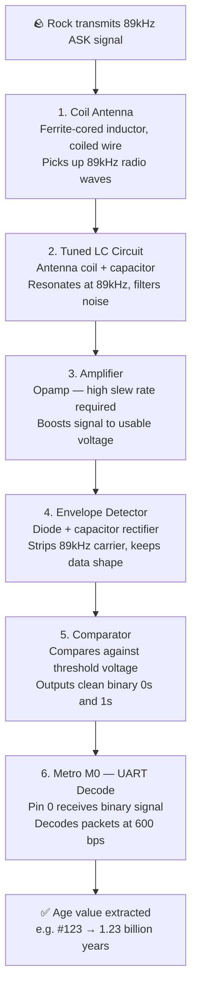

# Radio Subsystem — Age Detection
 
**Signal:** 89kHz ASK modulated, UART encoded at 600 bps  
**Output:** Rock age as ASCII string e.g. `#123` = 1.23 billion years

---

## Signal Processing Chain



---

## Step-by-Step Build Notes

### Step 1 — Coil Antenna

> Wind copper wire around a ferrite core to act as an inductor. A ferrite core was chosen over an air core as it significantly increases inductance for the same number of turns and physical size, improving sensitivity to weak radio signals. Use the LCR Bridge in the lab to measure its inductance.

**Inductance calculations:** [COIL_CALCULATIONS.md](COIL_CALCULATIONS.md)

**Photo / diagram:**


---

### Step 2 — Tuned LC Circuit

> Pair the coil (inductor L) with a capacitor (C) to form a resonant circuit tuned to 89kHz. Use the formula: f = 1 / (2π√LC) to calculate the right capacitor value for your coil's inductance.

**Photo / diagram:**


---

### Step 3 — Amplifier

> The antenna output will be in the millivolt range — too small to process. Use an opamp in an amplifier configuration to boost it. The opamp must have a high slew rate to handle the 89kHz signal without distortion.

**Key requirement:** Slew rate > 2π × 89,000 × Vpeak (calculate based on your signal level)

**Photo / diagram:**


---

### Step 4 — Envelope Detector

> The Metro M0 can't sample at 89kHz, so you need to strip the carrier and extract just the on/off data shape. A diode + capacitor does this.

**Photo / diagram:**


---

### Step 5 — Comparator

> Converts the smoothed analogue signal into a clean digital signal. Set a threshold voltage using a potential divider. A more robust approach is to derive the threshold automatically using a low-pass filter on the average signal level.

**Photo / diagram:**


---

### Step 6 — Metro M0 UART Decode

> Feed the binary signal into Pin 0 of the Metro M0. Configure Serial1 at 600 bps to receive UART packets. Use the USB Serial port separately for debugging. Data arrives LSB first.

```cpp
void setup() {
  Serial.begin(9600);   // USB debug port
  Serial1.begin(600);   // Rock signal on Pin 0
}

void loop() {
  if (Serial1.available()) {
    char c = Serial1.read();
    Serial.print(c);    // Print to debug monitor
  }
}
```

**Photo / diagram:**


---

## Component Research

| Component | Purpose | Options considered | Est. cost | Selected |
|-----------|---------|-------------------|-----------|---------|
| Magnet wire | Coil antenna | 0.4mm enamelled copper | £0 | ✅ Used |
| Capacitor | LC tuning | Ceramic, calculated value | ~£0 | TBC |
| Opamp | Amplifier + rectifier | TBC — high slew rate | ~£1.44 | TBC |
| Diode | Envelope detector | 1N4148 or Schottky | ~£0 | TBC |
| Resistors | Comparator threshold | Standard values | ~£0 | TBC |

---

## Testing Checklist

- [x] Coil built and inductance measured with LCR Bridge
- [x] LC circuit resonating at 89kHz (verify with oscilloscope)
- [x] Amplifier output visible on oscilloscope
- [x] Envelope detector showing clean data shape
- [x] Comparator outputting clean 0s and 1s
- [ ] Metro receiving and printing `#` character via Serial monitor
- [ ] Full age string decoded correctly from rock simulator

---

*Last updated: 2026-05-31*