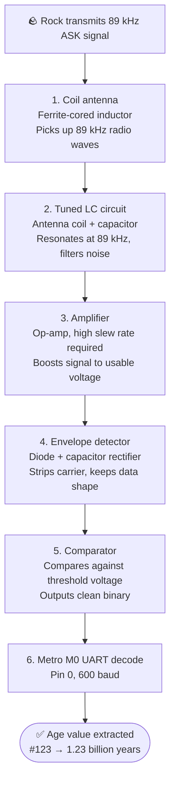
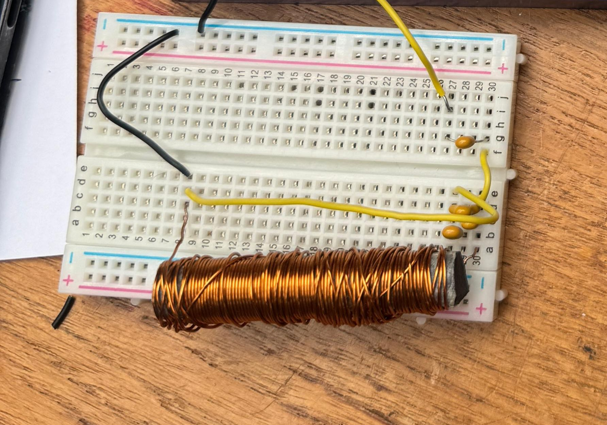

[← sensing/](../README.md) · [Repo home](../../README.md) · [Technical documentation](../../docs/README.md)

# Radio Subsystem — Age Detection

**Signal:** 89 kHz carrier, amplitude-shift keyed, UART encoded at 600 baud
**Output:** rock age as an ASCII string — `#123` means 1.23 billion years

> **Full write-up:** [docs/03-radio.md](../../docs/03-radio.md) — design reasoning, LTspice simulations, oscilloscope captures and measured results for every stage.
> This page is the build guide: what to make, in what order, and what to check before moving on.

---

## Signal processing chain


```mermaid
flowchart TD
    A["🪨 Rock transmits 89 kHz ASK signal"] --> B
    B["1. Coil antenna<br/>Ferrite-cored inductor<br/>Picks up 89 kHz radio waves"] --> C
    C["2. Tuned LC circuit<br/>Antenna coil + capacitor<br/>Resonates at 89 kHz, filters noise"] --> D
    D["3. Amplifier<br/>Op-amp, high slew rate required<br/>Boosts signal to usable voltage"] --> E
    E["4. Envelope detector<br/>Diode + capacitor rectifier<br/>Strips carrier, keeps data shape"] --> F
    F["5. Comparator<br/>Compares against threshold voltage<br/>Outputs clean binary"] --> G
    G["6. Metro M0 UART decode<br/>Pin 0, 600 baud"] --> H
    H(["✅ Age value extracted<br/>#123 → 1.23 billion years"])
```

---

## Build order

Each step should be verified on the oscilloscope before the next is added. Debugging a five-stage analogue chain built all at once is far harder than building it one stage at a time.

### Step 1 — Coil antenna

Wind copper wire around a ferrite core to form an inductor. Ferrite was chosen over a plain air core because it significantly increases inductance for the same number of turns and physical size, improving sensitivity to weak signals. Measure the finished coil's inductance with the lab LCR bridge — **use the measured value, not the calculated one, to size the tuning capacitor.**

| Parameter | Value |
|---|---|
| Core | Ferrite, 1 cm diameter × 5.5 cm |
| Turns | 120 |
| Wire | 0.40 mm enamelled copper |
| Measured inductance | 517 µH |
| Measured resistance | 0.488 Ω |

Full calculations: [COIL_CALCULATIONS.md](COIL_CALCULATIONS.md)



**Check before moving on:** LCR bridge gives a stable inductance reading in the expected range.

---

### Step 2 — Tuned LC circuit

Pair the coil with a capacitor to form a resonant circuit at 89 kHz:

$$f_0 = \frac{1}{2\pi\sqrt{LC}} \implies C = \frac{1}{(2\pi f_0)^2 L}$$

For 517 µH this gives 6.18 nF, built from real capacitors as **6.6 nF**.

**Check before moving on:** the signal at the coil peaks when the rock is near and perpendicular to it. Amplitude varies dramatically with distance and orientation — this is expected.

📷 *A photo of the built LC stage would go well here.*

---

### Step 3 — Amplifier

The antenna output is in the millivolt range. Use a non-inverting op-amp stage with a gain around 100. The op-amp must have enough gain-bandwidth product **and** slew rate at 89 kHz.

**Use the MCP6022**, not the MCP6002. The MCP6002's 1 MHz GBW limits usable gain at 89 kHz to about ×11, and its slew rate is marginal at 3.3 V. The MCP6022 gives 10 MHz GBW and 7 V/µs in the same pinout.

**Check before moving on:** output clips against the rails when the rock is close. Clipping is intended — see [docs/03-radio.md § 3.3](../../docs/03-radio.md#33-amplification).

📷 *A photo of the built amplifier stage would go well here.*

---

### Step 4 — Envelope detector

The Metro cannot sample at 89 kHz, so strip the carrier and keep the on/off envelope. A diode, capacitor and resistor do this.

With R = 10 kΩ and C = 10 nF, τ = 100 µs and $f_c$ = 1.59 kHz — comfortably below 89 kHz and above 600 Hz.

**Check before moving on:** the output follows the data envelope with a visible ~0.6 V diode drop, and the capacitor fully discharges between bits. If it does not, R is too large.

📷 *A photo of the built envelope detector would go well here.*

---

### Step 5 — Comparator

Converts the smoothed analogue signal into clean logic levels. Set the threshold with a potential divider.

The threshold is a genuine trade-off: too low and noise triggers it, too high and the signal fails to cross it at range. **≈0.75 V** was the value settled on, lower than the simulated half-supply figure, to preserve detection range.

**Check before moving on:** clean 0–3.3 V square wave with no ripple on the "on" cycles.

📷 *A photo of the built comparator stage would go well here.*

---

### Step 6 — Metro M0 UART decode

Feed the binary signal into **pin 0**. Configure `Serial1` at 600 baud. Use the USB serial port separately for debugging. Data arrives LSB first.

```cpp
void setup() {
  Serial.begin(9600);   // USB debug port
  Serial1.begin(600);   // Rock signal on Pin 0
}

void loop() {
  if (Serial1.available()) {
    char c = Serial1.read();
    Serial.print(c);    // Print to debug monitor
  }
}
```

> **Add a 1 kΩ series resistor** between the comparator output and the Metro input pin. Without it the Metro's internal protection diodes back-drive the comparator, clamping the signal so it never reaches a full 0–3.3 V swing. This one is easy to lose hours to.

**Check:** the `#` character appears in the serial monitor, followed by three digits.

📷 *A photo of the Metro wiring would go well here.*

---

## Components

| Component | Purpose | Selected |
|---|---|---|
| 0.40 mm enamelled copper wire | Coil antenna | ✅ Lab stock |
| Ferrite core, 1 cm × 5.5 cm | Coil antenna | ✅ Lab stock |
| Capacitors totalling 6.6 nF | LC tuning | ✅ Lab stock |
| MCP6022 | Amplifier | ✅ £1.44 |
| 1N4148 | Envelope detector | ✅ Lab stock |
| LM393 | Comparator | ✅ £0.32 |
| Resistors | Threshold, gain, RC | ✅ Lab stock |

---

## Testing checklist

- [x] Coil built and inductance measured with LCR bridge
- [x] LC circuit resonating at 89 kHz, verified on oscilloscope
- [x] Amplifier output visible and clipping to rails
- [x] Envelope detector showing clean data shape
- [x] Comparator outputting clean logic levels
- [x] Metro receiving and printing `#` via serial monitor
- [x] Full age string decoded correctly from rock simulator

---

## Firmware

| | |
|---|---|
| Test code | [`radio_test_code/`](radio_test_code/) |
| Flight code | [`Full_Board_Code/Board 2/`](../../Full_Board_Code/Board%202/) |
